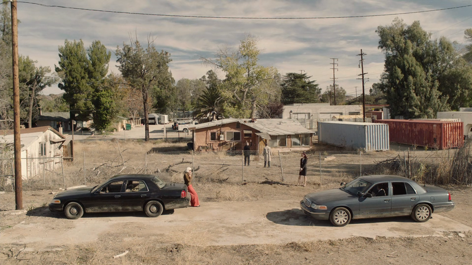

#+TITLE: her.esy.fun
#+AUTHOR: Yann Esposito
#+EMAIL: yann.esposito@gmail.com
#+KEYWORDS: programming
#+DESCRIPTION:

Welcome to [[https://her.esy.fun][her.esy.fun]]!

* Writer                                                                                :noexport:

#+BIND: org-exporet-publishing-directory "./dist"

#+LANGUAGE: en
#+LANG: en
#+OPTIONS: ':t *:t -:t ::t <:t H:3 \n:nil ^:t arch:headline author:t c:nil
#+OPTIONS: creator:comment d:(not LOGBOOK) date:t e:t email:nil f:t inline:t
#+OPTIONS: p:nil pri:nil stat:t tags:t tasks:t tex:t timestamp:t
#+OPTIONS: html-style:nil num:nil toc:nil
#+OPTIONS: todo:t |:t
#+CREATOR: Spacemacs, org-mode  (Emacs 26.1, Org mode 9.2.3)
#+HTML_HEAD: <link rel="stylesheet" type="text/css" href="/minimalist.css" />

#+BIND: org-export-publishing-directory "./dist"

* Testing

I will test some classical things.
First let's test *bold*, then /italic/ then, =code= and ~terminal~.
Also forgot +barré+.
And a veryveryveryverylongwordlike Supercalifragilisticexpialidocious
and even longer SupercalifragilisticexpialidociousSupercalifragilisticexpialidocious
and even very very longer
SupercalifragilisticexpialidociousSupercalifragilisticexpialidociousSupercalifragilisticexpialidociousSupercalifragilisticexpialidociousSupercalifragilisticexpialidocious

#+begin_src clojure
(def foo
  "this is some clojure code"
  [& args]
  (string/join ", " args))
#+end_src

Then let's try some blockquote:

#+begin_quote
This is a quote here. I'm fond of using it.

--  Shakespeare
#+end_quote

- item 1
- item 2
  - sub-item
  - re-sub-item
    - sub-sub-item
  - sub
- item 3
- item 4

1. foo
2. bar
3. baz

------------------------

some text

A figure with a caption:

#+CAPTION: The bomb that started the expriment in Twin Peaks
#+ATTR_HTML: :alt The bomb

* h1 test
** h2 test
*** h3 test
**** h4 test
***** h5 test
****** h6 test
******* lower ...
******** deeper
********* even deeper...
********** still even deeeeper
           Deep enough now :)
