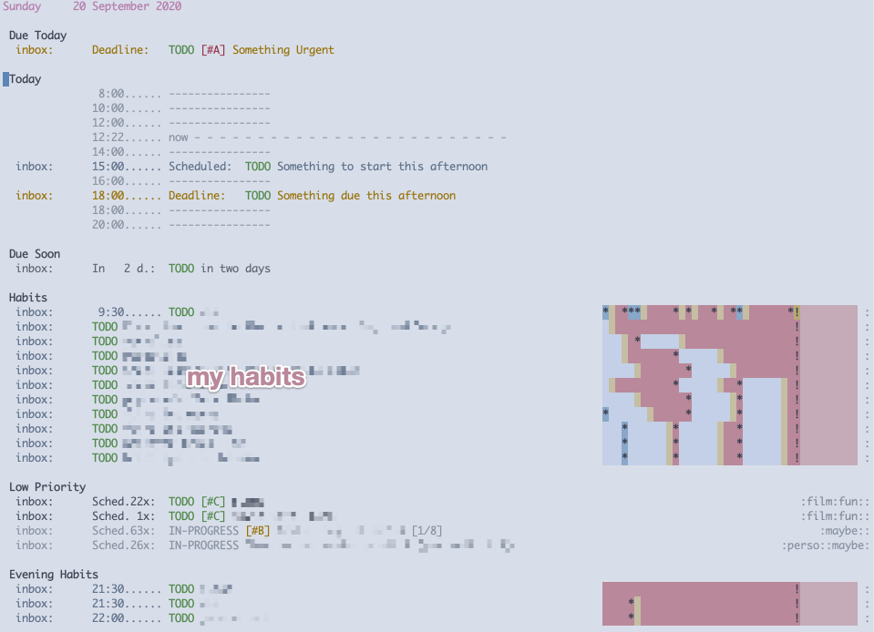

:PROPERTIES:
:ID:       21c48431-c0db-4a34-95fe-7228fea6233f
:END:
#+TITLE: How I use org-mode
#+AUTHOR: Yann Esposito
#+EMAIL: yann@esposito.host
#+DATE: [2019-09-30 Mon]
#+KEYWORDS: org-mode
#+DESCRIPTION: How I use org-mode
#+OPTIONS: auto-id:t

In this article I'll try to give an overview of my current use of [[https://orgmode.org][org mode]].
I use org mode for:

- tasks management & tracking
- writing documents (articles, book, etc...)
- note taking ; which I consider slightly different from just writing documents

It took me a few month to discover a few great org-mode features that
really changed the way I looked at it.
After discovering those it is a real life changer.

I hope that I could help you discover why org mode is so praised and be
able to take advantage of its awesomeness faster than I did.

* Workflows
:PROPERTIES:
:CUSTOM_ID: workflows
:END:

** Worfklow 1: See Things to do: org-agenda + clock
:PROPERTIES:
:CUSTOM_ID: worfklow-1--org-agenda---clock
:END:

So one thing is:

1. look at the current tasks planned for today
2. select a task, clock it
3. work on the task
4. back to the task and clock it out.

I work most of my using emacs[fn:emacs-digression].
Generally the first thing I do in the morning is opening `org-calendar` and
this is what I see:

#+BEGIN_SRC
Sunday     20 September 2020

 Due Today
  inbox:      Deadline:   TODO [#A] Something Urgent

 Today
               8:00...... ----------------
              10:00...... ----------------
              12:00...... ----------------
              12:38...... now - - - - - - - - - - - - - - - - - - - - - - - - -
              14:00...... ----------------
  inbox:      15:00...... Scheduled:  TODO Something to start this afternoon
              16:00...... ----------------
  inbox:      18:00...... Deadline:   TODO Something due this afternoon
              18:00...... ----------------
              20:00...... ----------------

 Due Soon
  inbox:      In   2 d.:  TODO in two days

 Habits
  inbox:       9:30...... TODO Habit in the morning          *  ***     * *   *  **       *!          :
  inbox:      TODO Habit weekly                                                            !          :
  inbox:      TODO Habit weekly                                   *                        !          :
  inbox:      TODO Habit weekly                                         *                  !          :
  inbox:      TODO Habit weekly                                           *                !          :
  inbox:      TODO Habit weekly                                         *         *        !          :
  inbox:      TODO Habit weekly                                           *       *        !          :
  inbox:      TODO Habit weekly                              *            *       *        !          :
  inbox:      TODO Habit weekly                                 *       *         *        !          :
  inbox:      TODO Habit weekly                                 *       *         *        !          :
  inbox:      TODO Habit weekly                                 *       *         *        !          :

 Low Priority
  inbox:      Sched.22x:  TODO [#C] fun maybe                                                    :fun::
  inbox:      Sched. 1x:  TODO [#C] another thing                                                :fun::
  inbox:      Sched.63x:  IN-PROGRESS [#B] play  [1/8]                                         :maybe::
  inbox:      Sched.26x:  IN-PROGRESS thing not done for 26 days                         :perso::maybe:

 Evening Habits
  inbox:      21:30...... TODO habit in the evening                                        !          :
  inbox:      21:30...... TODO habit in the evening              *                         !          :
  inbox:      22:00...... TODO habit in the evening              *                         !          :
#+END_SRC

I replaced the tasks names by =XXX= but this is just text.
With colors it looks like this:

#+CAPTION: Org super calendar view
#+NAME: fig:org-super-calendar

So unlike most fancy todo list we are used to, here this look pretty raw.
But in my opinion having a brutalist interface is part of why org-mode is
great.
So this is text oriented and thus distraction free.
It goes directly to the essential.

So mainly I see what I planned to do today.
I got a few "Due Soon" tasks in case I have the time to handle those today.

When I start working on a task I start a clock on it (I simply type =I=
when my cursor is on the TODO line)
When I finished some task I change its stats from TODO to something else.
Mainly I'm prompted when doing so:

#+BEGIN_SRC
{ [t] TODO   [p] IN-PROGRESS   [h] HOLD   [w] WAITING
  [d] DONE   [c] CANCELLED     [l] HANDLED }
#+END_SRC

** Workflow 2: org-capture/org-refile
:PROPERTIES:
:CUSTOM_ID: workflow-2--org-capture-org-refile
:END:

But quite often I don't know what the tasks for the day will be.
Very often, I need to work on things I couldn't plan.
There can be interruptions, or new tasks requiring my attention during the
day.

In that case I use =org-capture= along =org-refile=.
Mainly =org-capture= helps you create a new TODO entry.
And =org-refile= will help you move that TODO entry to the correct place.

So let say I get a DM in the chat asking me to do something.
I generally start org capture (for me it's =SPC X=).
I am presented with the following choice:

#+BEGIN_SRC
Select a capture template
=========================

[t] todo
[c] chat
[e] email
[m] meeting
[p] pause
[r] review
[w] work
[i] interruption
[f] chore
---------------------------------------------------------------------------
[q] Abort
#+END_SRC

I then type the letter of the kind of tasks I'd like to create.
If I select =t= I have a simple TODO:

#+BEGIN_SRC

#+END_SRC
* Footnotes
:PROPERTIES:
:CUSTOM_ID: footnotes
:END:

[fn:emacs-digression]
/Short digression/:
Historically, I coded using different IDEs.
Then I worked for a company that forced me to use terrible keyboards and
after just a few weeks I started to have serious wrist issues.
So to minimize that pain I switched to vim.
And it was /awesome/.
Once you're use to the power of vim keybinding forever your soul will bound
to them.
So learning vim is a bit like learning a new music instrument.
You need to construct some muscle memory and integrate one after one new
tricks.
Once learned your personal editing power start to become overwhelming.

After a few years of vim, I wanted to try to explore new editor tooling.
So I switched to emacs using the spacemacs distribution.
So mainly it's vim but with even better keybindgs, helpers and within
emacs.
The main reason for the switch was that vimscript is a really bad language
to configure your editor.
Emacs use emacs-LISP.
For editor customization a LISP looked perfect to me.
LISP is still one of the most powerful and easy to use programming language
to date.

And recently, as my personal configuration started to grow so much I
switched to [[https://github.com/hlissner/doom-emacs][doom-emacs]].
I was quite hesitant to do the switch but so far its been a pleasure.
IMHO using [[https://github.com/hlissner/doom-emacs][doom-emacs]] is a lot better than using my own personal
configuration from scratch because I wouldn't be able to end up with so
much configuration quality.
