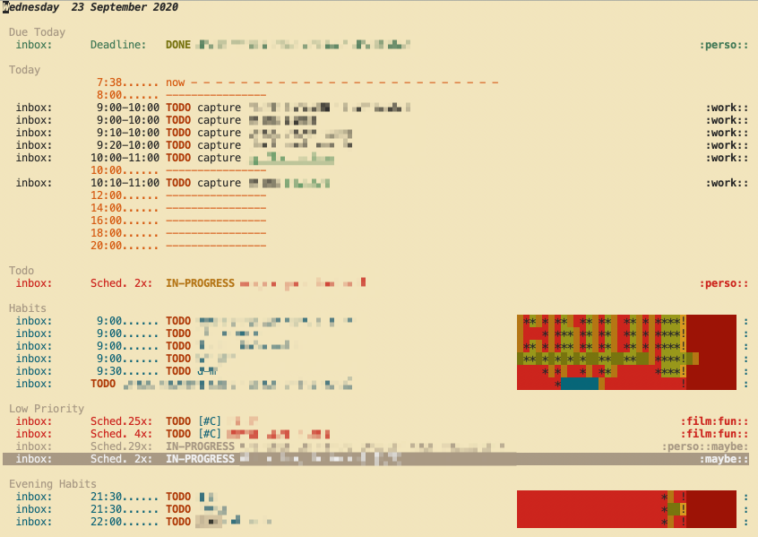

:PROPERTIES:
:ID:       21c48431-c0db-4a34-95fe-7228fea6233f
:END:
#+TITLE: How I use org-mode
#+AUTHOR: Yann Esposito
#+EMAIL: yann@esposito.host
#+DATE: [2019-09-30 Mon]
#+KEYWORDS: org-mode
#+DESCRIPTION: How I use org-mode
#+OPTIONS: auto-id:t toc:t

In this article I'll try to give an overview of my current use of [[https://orgmode.org][org mode]].
I use org mode for:

- tasks management & tracking
- writing documents (articles, book, etc...)
- note taking ; which I consider slightly different from just writing documents

It took me a few month to discover a few great org-mode features that
really changed the way I looked at it.
After discovering those it is a real life changer.

I hope that I could help you discover why org mode is so praised and be
able to take advantage of its awesomeness faster than I did.

* Workflows
:PROPERTIES:
:CUSTOM_ID: workflows
:END:

** Worfklow 1: See Things to do: org-agenda + clock
:PROPERTIES:
:CUSTOM_ID: worfklow-1--org-agenda---clock
:END:

1. look at the current tasks planned for today
2. select a task, clock it
3. work on the task
4. back to the task and clock it out.

I work most of my using emacs[fn:emacs-digression].
Generally the first thing I do in the morning is opening `org-calendar`.
It looks like this:

#+ATTR_ORG: :width 400
#+CAPTION: Org super calendar view
#+NAME: fig:org-super-agenda

Pretty brutalist interface which is a great thing to me.
Distraction free interface going to the essential.

With this view, I see what I planned to do today.
I also see a few "Due Soon" tasks in case I have the time to handle those.

When I start working on a task I start a clock on it (I simply type =I=
when my cursor is on the TODO line).
When I finished some task I change its status from TODO to something else.
Mainly I'm prompted when doing so:

#+BEGIN_SRC
{ [t] TODO   [p] IN-PROGRESS   [h] HOLD   [w] WAITING
  [d] DONE   [c] CANCELLED     [l] HANDLED }
#+END_SRC

And that's it.
The time spent on the task as been clocked I can work on another task.

Looking at the agenda view you could notice habits.
They start to become green when you are doing them correctly.

But generally, I don't use much direct clocking from the agenda.
Most of the time I prefer the capture mechanism.
Which bring us to "Worfklow 2".

** Workflow 2: Tracking; org-capture
:PROPERTIES:
:CUSTOM_ID: workflow-2--org-capture-org-refile
:END:

Most of the tasks I perform on the day are not planned.
I have a generic routine + some prepared events and tasks to performs.
But during the day you have multiple interruptions, and part of my job is
to write code reviews too.
I cannot plan those.

In that case I use =org-capture= along =org-refile=.
Mainly =org-capture= helps you create a new TODO entry.
And =org-refile= will help you move that TODO entry to the correct place.

So let say I get a direct message in the chat asking me to do something.
I generally start org capture (for me it's =SPC X=).
I am presented with the following choice:

#+BEGIN_SRC
Select a capture template
=========================

[t] todo
[c] chat
[e] email
[m] meeting
[p] pause
[r] review
[w] work
[i] interruption
[f] chore
---------------------------------------------------------------------------
[q] Abort
#+END_SRC

In my example it was a chat interruption.
So I type =i= that presents me with this

#+BEGIN_SRC
  **** IN-PROGRESS |  :interruption:
  :LOGBOOK:
  [2020-09-23 Wed 08:01]
  ref :: [link-to-where-I-was-in-emacs-when-captured]
#+END_SRC

My cursor placed where the =|= is displayed.
Here I add the tag =chat= and a small description, "dm from John about X" for example.
Then I type =C-c C-c= and the TODO is placed in a =tracker.org= file under
a date tree that looks like this:

#+BEGIN_SRC org-mode
  * 2020
  ** 2020-W39
  *** 2020-09-21 Monday
  *** 2020-09-22 Tuesday
  *** 2020-09-23 Wednesday
  **** IN-PROGRESS Chat with John about X                          :interruption:chat:
  :LOGBOOK:
  CLOCK: [2020-09-23 Wed 17:58]
  :END:
  [2020-09-23 Wed 17:58]
  ref ::
  ...
#+END_SRC

So the clock for this task started at the moment at made the capture.
In my workflow, I prefer to finish the capture and stop clock later.
So after I finished the capture, the clock is still running while the task
is put in my tracker file.

Once I finished with that task.
I can:

1. Jump to the tasks with =SPC n o= (=org-clock-goto=), and stop the
   clock =SPC m c o= (=clock-out=).
2. Jump to the task and change its status to =DONE= which will stop the clock.
3. Capture another tasks which will stop the clock on the current task and
   will start on the new one.

By the end of the day, my tracker file will contain a date tree with all
the tasks I done in the day.
All tasks nicely clocked.
I generally create a clock report that look like this:

#+BEGIN_SRC
  #+BEGIN: clocktable :scope subtree :maxlevel 4 :timestamp t
  #+CAPTION: Clock summary at [2020-09-23 Wed 08:20]
  | Timestamp              | Headline                                       | Time   |   |      |      |
  |------------------------+------------------------------------------------+--------+---+------+------|
  |                        | *Total time*                                   | *6:40* |   |      |      |
  |------------------------+------------------------------------------------+--------+---+------+------|
  |                        | \_    2020-09-21 Monday                        |        |   | 7:40 |      |
  | [2020-09-21 Mon 08:54] | \_      check chat                             |        |   |      | 0:36 |
  | [2020-09-21 Mon 09:30] | \_      check reviews                          |        |   |      | 0:41 |
  | [2020-09-21 Mon 10:11] | \_      check emails                           |        |   |      | 0:07 |
  | [2020-09-21 Mon 10:37] | \_      review PR about xxx                    |        |   |      | 0:44 |
  | [2020-09-21 Mon 11:21] | \_      update my PR from feedbacks            |        |   |      | 0:36 |
  | [2020-09-21 Mon 12:08] | \_      review John's PR about Foo             |        |   |      | 0:12 |
  | [2020-09-21 Mon 13:41] | \_      review M's PR about Bar                |        |   |      | 0:11 |
  | [2020-09-21 Mon 13:53] | \_      another thing                          |        |   |      | 0:16 |
  | [2020-09-21 Mon 14:09] | \_      review PR                              |        |   |      | 0:51 |
  | [2020-09-21 Mon 15:00] | \_      work on PR                             |        |   |      | 1:30 |
  | [2020-09-21 Mon 16:49] | \_      check another PR                       |        |   |      | 0:33 |
  | [2020-09-21 Mon 17:03] | \_      answer email                           |        |   |      | 0:55 |
  | [2020-09-21 Mon 17:58] | \_      Chat John about X                      |        |   |      | 0:28 |

#+END_SRC

And that's mostly it for TODOs and tasks handling.

** Workflow 3: Add new tasks; org-capture / org-refile
:PROPERTIES:
:CUSTOM_ID: workflow-3--org-capture---org-refile
:END:
Another thing I do quite often.
I need to add new task to be done.
Be it for today or another day.

In that case, I generally use org-capture again.
This time I choose =t= for TODO and I generally detail the task to be done.
I add either a SCHEDULE (when I plan to start) or a DEADLINE (when this
must be finished) and I refile it.

So refile will start a fuzzy search to put this task under some subtree.
So instead of going to my =tracker.org= file, this goes to my =inbox.org=
file.

And it will appear in my agenda.

* Footnotes
:PROPERTIES:
:CUSTOM_ID: footnotes
:END:

[fn:emacs-digression]
/Short digression/:
Historically, I coded using different IDEs.
Then I worked for a company that forced me to use terrible keyboards and
after just a few weeks I started to have serious wrist issues.
So to minimize that pain I switched to vim.
And it was /awesome/.
Once you're use to the power of vim keybinding forever your soul will bound
to them.
So learning vim is a bit like learning a new music instrument.
You need to construct some muscle memory and integrate one after one new
tricks.
Once learned your personal editing power start to become overwhelming.

After a few years of vim, I wanted to try to explore new editor tooling.
So I switched to emacs using the spacemacs distribution.
So mainly it's vim but with even better keybindgs, helpers and within
emacs.
The main reason for the switch was that vimscript is a really bad language
to configure your editor.
Emacs use emacs-LISP.
For editor customization a LISP looked perfect to me.
LISP is still one of the most powerful and easy to use programming language
to date.

And recently, as my personal configuration started to grow so much I
switched to [[https://github.com/hlissner/doom-emacs][doom-emacs]].
I was quite hesitant to do the switch but so far its been a pleasure.
IMHO using [[https://github.com/hlissner/doom-emacs][doom-emacs]] is a lot better than using my own personal
configuration from scratch because I wouldn't be able to end up with so
much configuration quality.
