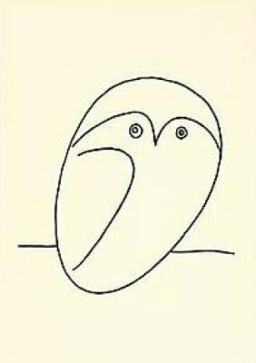
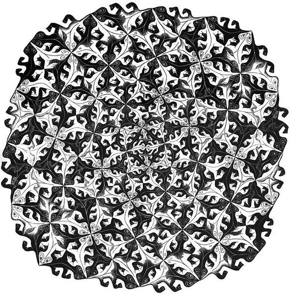

#+title: Learn Haskell Now!
#+subtitle: A dense Haskell learning material for the brave
#+date: [2019-12-15 Sun]
#+author: Yann Esposito
#+EMAIL: yann@esposito.host
#+keywords: Haskell, programming, functional, tutorial                                |
#+DESCRIPTION: A very dense introduction and Haskell tutorial. Brace yourself.
#+OPTIONS: auto-id:t toc:t
#+STARTUP: overview

#+begin_notes
A very short and intense introduction to Haskell.

This is an update of my old (2012) article.
A lot of things have changed since then.
And I took the time to read it again.
#+end_notes

#+begin_quote
*Prelude*

In 2012, I really believed that every developer should learn Haskell.
This is why I wrote my old article.
This is the end of 2019 and I still strongly believe that, yes, you must at
least be able to understand enough Haskell to write a simple tool.

But a few things have changed in the Haskell world.

1. Project building has a few working solution. When I wrote this article I
   had a few web application that I can no longer build today.
   I mean, if I really want to invest some time, I'm sure I could make
   those project build again. But this is not worth the hassle.
   Now we have =stack=, =nix=, =cabal new-build= and I'm sure some other
   solutions.
2. GHC is able to do a lot more magic than then.
   This is beyond the scope of an introductory material in my opinion.
   But, while the learning curve is as steep as before the highest point of
   learning just jumped higher than before with each new GHC release.
3. Still no real consencus about how to work, learn, and use Haskell. In my
   opinion there are three different perspective on Haskell that could
   definitively change how you make decisions about different aspect of
   Haskell programming. I believe the main groups of ideolgies are
   application developers, library developers and even language (mostly
   GHC) developers. I kind of find those tensions a proof of an healthy
   environment. There are different solutions to the same problems and that
   is perfectly fine. This is quite different when you compare to other
   language ecosystems where decisions are more controlled or enforced. I
   feel fine with both approaches. But you must understand that there is
   not really any central mindset within Haskeller unlike I can find in
   some other programming language communities.
4. I think that Haskell is now perceived as a lot more serious programming
   language now.
   There are a lot more big projects written in Haskell not just toy
   projects.
   Thus Haskell as proved that it can be considered to write succesful
   complex entreprise projects.

While the ecosystem evolved I believe that I myself have certainly matured.
Since 2013 I am paid to develop in Clojure.
Most of my personal side project are written in Haskell or in an
Haskell-inspired language.

As such I can follow two functional programming communities growth and
evolution.
I am kind of confident that my Haskell understanding is a lot better than
before.
But I still think, the ability to learn new Haskell subject is infinite.

One article I would like to write someday is about my current team
philosophy about programming.
Our main rule is to use as few features of a programming language as
possible to achieve your goal.
This is a kind of merge between minimalism and pragmatism that in the end
provide a tremendous amount of benefits.
This is why, even if I like to play with the latest Haskell trendy feature,
I generally program without those.
With just a very few amount of Haskell features you will already be in
enviromnent with a *lot* of benefits as compared to many programming
languages.

So enough talk, here is my old article new again, with just a few changes
and cleanup.
Also, I will try to go a bit further than before.
By the end of this article you should be autonomous if you want to create a
new product in Haskell.
Be it a simple command line tool or a web application.
If you are going toward GUI programming, this is a whole subject on its own
and I do not really mention it.

My .02 for "Single Page Application" choice is to use Purescript with the
halogen framework.
Purescript is really awesome as well as halogen.
#+end_quote

* Introduction
:PROPERTIES:
:CUSTOM_ID: introduction
:END:

I really believe that every developer should learn Haskell.
I don't think every dev needs to be a super Haskell ninja, but they should
at least discover what Haskell has to offer.
Learning Haskell opens your mind.

Mainstream languages share the same foundations:

- variables
- loops
- pointers[fn:1]
- data structures, objects and classes (for most)

Haskell is very different.
The language uses a lot of concepts I had never heard about before.
Many of those concepts will help you become a better programmer.

But learning Haskell can be (and will certainly be) hard.
It was for me.
In this article I try to provide as much help as possible to accelerate
your learning.

This article will certainly be hard to follow.
This is on purpose.
There is no shortcut to learning Haskell.
It is hard and challenging.
But I believe this is a good thing.
It is because it is hard that Haskell is interesting and rewarding.

Today, I could not really provide a conventional path to learn Haskell.
So I think the best I can do is point you to the [[https://www.haskell.org/documentation/][haskell.org]] documentation
website.
And you will see that most path involve a quite long learning process.
By that, I mean that you should read a long book and invest a lot of hours
and certainly days before having a good idea about what Haskell is all about.

In contrast, this article is a very brief and dense overview of all
major aspects of Haskell.
I also added some information I lacked while I learned Haskell.

The article contains five parts:

- Introduction: a short example to show Haskell can be friendly.
- Basic Haskell: Haskell syntax, and some essential notions.
- Normal Difficulty Part:

  - Functional style; a progressive example, from imperative to
    functional style
  - Types; types and a standard binary tree example
  - Infinite Structure; manipulate an infinite binary tree!

- Nightmare Difficulty Part:

  - Deal with IO; A very minimal example
  - IO trick explained; the hidden detail I lacked to understand IO
  - Monads; incredible how we can generalize

- Hell Difficulty Part:

  - Write a real world command line application
  - Write a real world full featured REST API

- Appendix:

  - More on infinite tree; a more math oriented discussion about
    infinite trees
** Helpers                                                                                                :noexport:
:PROPERTIES:
:CUSTOM_ID: helpers
:END:

#+MACRO: lnk @@html:<a href="$1" style="float:right" target="_blank">$1 ⤓</a>@@

** Install
:PROPERTIES:
:CUSTOM_ID: install
:END:

#+CAPTION: Haskell logo

1. Install [[https://nixos.org/nix][nix]]
2. create a new empty directory =hsenv= somewhere
3. Put the following =shell.nix= file inside it

   {{{lnk(shell.nix)}}}
   #+begin_src nix :tangle shell.nix
   { nixpkgs ? import (fetchTarball https://github.com/NixOS/nixpkgs/archive/19.09.tar.gz) {} }:
   let
     inherit (nixpkgs) pkgs;
     inherit (pkgs) haskellPackages;

     haskellDeps = ps: with ps; [
       base
       protolude
       containers
     ];

     ghc = haskellPackages.ghcWithPackages haskellDeps;

     nixPackages = [
       ghc
       pkgs.gdb
       haskellPackages.cabal-install
     ];
   in
   pkgs.stdenv.mkDerivation {
     name = "env";
     buildInputs = nixPackages;
     shellHook = ''
        export PS1="\n[hs:\033[1;32m\]\W\[\033[0m\]]> "
     '';
   }
   #+end_src

4. In the =hsenv= directory, in a terminal, run =nix-shell --pure=.
   You should wait a lot of time for everything to download.
   And you should be ready.
   You will have in your PATH:
   - =ghc=, the Haskell compiler
   - =ghci= that we can described as a Haskell REPL
   - =runghc= that will be able to interpret a Haskell file
   - =cabal= which is the main tool to deal with Haskell projects
   - the Haskell libraries =protolude= and =containers=.
5. To test your env, rung =ghci= and type =import Protolude= you should see
   something like this:

   #+begin_src
   ~/hsenv> nix-shell
   [nix-shell:~/hsenv]$ ghci
   GHCi, version 8.6.5: http://www.haskell.org/ghc/  :? for help
   Prelude> import Protolude
   Prelude Protolude>
   #+end_src

Congratulations you should be ready to start now.

#+begin_notes
- There are multiple ways to install Haskell and I don't think there is a
  full consensus between developer about what is the best method.
  If you whish to use another method take a look at [[http://haskell.org][haskell.org]].
- This install method is only suitable for using as a playground and I
  think perfectly adapted to run code example from this article.
  I do not recommend it for serious development.
- =nix= is a generic package manager and goes beyond Haskell.
  One great good point is that it does not only manage Haskell packages but
  really a lot of other kind of packages.
  This can be quite helpful if you need to depends on a Haskell package that
  itself depends on a system library, for example =ncurses=.
- I use [[http://nixos.org/nix][=nix=]] for other projects unrelated to Haskell.
  For example, I use the nix-shell bang pattern for shell script for which
  I can assume the executable I want are present.
#+end_notes

#+begin_notes
*BONUS*: use [[https://direnv.net][=direnv=]]

#+begin_src
~ cd hsenv
~ echo "use nix" > .envrc
~ direnv allow
#+end_src

Now each time you'll cd into your hsenv directory you'll get the
environment set for you.
#+end_notes

** Don't be afraid
:PROPERTIES:
:CUSTOM_ID: don't-be-afraid
:END:

#+CAPTION: The Scream

Many books/articles about Haskell start by introducing some esoteric
formula (quick sort, Fibonacci, etc...).
I will do the exact opposite.
At first I won't show you any Haskell super power.
I will start with similarities between Haskell and other programming
languages.
Let's jump to the mandatory "Hello World".

{{{lnk(hello.hs)}}}
#+BEGIN_SRC haskell :tangle hello.hs
main = putStrLn "Hello World!"
#+END_SRC

#+BEGIN_EXAMPLE
~ runghc hello.hs
Hello World!
#+END_EXAMPLE

Now, a program asking your name and replying "Hello" using the name you
entered:

{{{lnk(name.hs)}}}
#+BEGIN_SRC haskell :tangle name.hs
main = do
    print "What is your name?"
    name <- getLine
    print ("Hello " ++ name ++ "!")
#+END_SRC

First, let us compare this with similar programs in a few imperative
languages:

#+BEGIN_SRC python
# Python
print "What is your name?"
name = raw_input()
print "Hello %s!" % name
#+END_SRC

#+BEGIN_SRC ruby
# Ruby
puts "What is your name?"
name = gets.chomp
puts "Hello #{name}!"
#+END_SRC

#+BEGIN_SRC C
// In C
#include <stdio.h>
int main (int argc, char **argv) {
    char name[666]; // <- An Evil Number!
    // What if my name is more than 665 character long?
    printf("What is your name?\n");
    scanf("%s", name);
    printf("Hello %s!\n", name);
    return 0;
}
#+END_SRC

The structure is the same, but there are some syntax differences.
The main part of this tutorial will be dedicated to explaining why.

In Haskell there is a =main= function and every object has a type.
The type of =main= is =IO ()=.
This means =main= will cause side effects.

Just remember that Haskell can look a lot like mainstream imperative
languages.

** Very basic Haskell
:PROPERTIES:
:CUSTOM_ID: very-basic-haskell
:END:

#+CAPTION: Picasso minimal owl

Before continuing you need to be warned about some essential properties
of Haskell.

/Functional/

Haskell is a functional language.
If you have an imperative language background, you'll have to learn a lot
of new things.
Hopefully many of these new concepts will help you to program even in
imperative languages.

/Advanced Static Typing/

Instead of being in your way like in =C=, =C++= or =Java=, the type system
is here to help you.

/Purity/

Generally your functions won't modify anything in the outside world.
This means they can't modify the value of a variable, can't get user input,
can't write on the screen, can't launch a missile.
On the other hand, parallelism will be very easy to achieve.
Haskell makes it clear where effects occur and where your code is pure.
Also, it will be far easier to reason about your program.
Most bugs will be prevented in the pure parts of your program.

Furthermore, pure functions follow a fundamental law in Haskell:

#+BEGIN_QUOTE
Applying a function with the same parameters always returns the same value.
#+END_QUOTE

/Laziness/

Laziness by default is a very uncommon language design.
By default, Haskell evaluates something only when it is needed.
In consequence, it provides a very elegant way to manipulate infinite
structures, for example.

A last warning about how you should read Haskell code.
For me, it is like reading scientific papers.
Some parts are very clear, but when you see a formula, just focus and read
slower.
Also, while learning Haskell, it /really/ doesn't matter much if you don't
understand syntax details.
If you meet a =>>==, =<$>=, =<-= or any other weird symbol, just ignore
them and follows the flow of the code.

*** Function declaration
:PROPERTIES:
:CUSTOM_ID: function-declaration
:END:

You might be used to declaring functions like this:

In =C=:

#+BEGIN_SRC C
int f(int x, int y) {
    return x*x + y*y;
}
#+END_SRC

In JavaScript:

#+BEGIN_SRC javascript
function f(x,y) {
    return x*x + y*y;
}
#+END_SRC

in Python:

#+BEGIN_SRC python
def f(x,y):
    return x*x + y*y
#+END_SRC

in Ruby:

#+BEGIN_SRC ruby
def f(x,y)
    x*x + y*y
end
#+END_SRC

In Scheme:

#+BEGIN_SRC scheme
(define (f x y)
    (+ (* x x) (* y y)))
#+END_SRC

Finally, the Haskell way is:

#+BEGIN_SRC haskell
f x y = x*x + y*y
#+END_SRC

Very clean. No parenthesis, no =def=.

Don't forget, Haskell uses functions and types a lot.
It is thus very easy to define them.
The syntax was particularly well thought out for these objects.

*** A Type Example
:PROPERTIES:
:CUSTOM_ID: a-type-example
:END:

Although it is not mandatory, type information for functions is usually
made explicit.
It's not mandatory because the compiler is smart enough to infer it for
you.
It's a good idea because it indicates intent and understanding.

Let's play a little.
We declare the type using =::=

{{{lnk(basic.hs)}}}
#+BEGIN_SRC haskell :tangle basic.hs
f :: Int -> Int -> Int
f x y = x*x + y*y

main = print (f 2 3)
#+END_SRC

#+BEGIN_EXAMPLE
[nix-shell:~/hsenv]$ runghc basic.hs
13
#+END_EXAMPLE

Now try

{{{lnk(error_basic.hs)}}}
#+BEGIN_SRC haskell :tangle error_basic.hs
f :: Int -> Int -> Int
f x y = x*x + y*y

main = print (f 2.3 4.2)
#+END_SRC

You should get this error:

#+BEGIN_EXAMPLE
[nix-shell:~/hsenv]$ runghc error_basic.hs

error_basic.hs:4:17: error:
    • No instance for (Fractional Int) arising from the literal ‘2.3’
    • In the first argument of ‘f’, namely ‘2.3’
      In the first argument of ‘print’, namely ‘(f 2.3 4.2)’
      In the expression: print (f 2.3 4.2)
  |
4 | main = print (f 2.3 4.2)
  |                 ^^^
#+END_EXAMPLE

The problem: =4.2= isn't an Int.

The solution: don't declare a type for =f= for the moment and let Haskell
infer the most general type for us:

{{{lnk(float_basic.hs)}}}
#+BEGIN_SRC haskell :tangle float_basic.hs
f x y = x*x + y*y

main = print (f 2.3 4.2)
#+END_SRC

#+begin_example
[nix-shell:~/hsenv]$ runghc float_basic.hs
22.93
#+end_example

It works!
Luckily, we don't have to declare a new function for every single type.
For example, in =C=, you'll have to declare a function for =int=, for
=float=, for =long=, for =double=, etc...

But, what type should we declare?
To discover the type Haskell has found for us, just launch ghci:

#+BEGIN_EXAMPLE
% ghci
GHCi, version 7.0.4: http://www.haskell.org/ghc/  :? for help
Loading package ghc-prim ... linking ... done.
Loading package integer-gmp ... linking ... done.
Loading package base ... linking ... done.
Loading package ffi-1.0 ... linking ... done.
Prelude> let f x y = x*x + y*y
Prelude> :type f
f :: Num a => a -> a -> a
#+END_EXAMPLE

Uh? What is this strange type?

#+BEGIN_SRC haskell
Num a => a -> a -> a
#+END_SRC

First, let's focus on the right part =a -> a -> a=.
To understand it, just look at a list of progressive examples:

| The written type   | Its meaning                                                               |
|--------------------+---------------------------------------------------------------------------|
| =Int=              | the type =Int=                                                            |
| =Int -> Int=       | the type function from =Int= to =Int=                                     |
| =Float -> Int=     | the type function from =Float= to =Int=                                   |
| =a -> Int=         | the type function from any type to =Int=                                  |
| =a -> a=           | the type function from any type =a= to the same type =a=                  |
| =a -> a -> a=      | the type function of two arguments of any type =a= to the same type =a=   |

In the type =a -> a -> a=, the letter =a= is a /type variable/.
It means =f= is a function with two arguments and both arguments and the
result have the same type.
The type variable =a= could take many different type values.
For example =Int=, =Integer=, =Float=...

So instead of having a forced type like in =C= and having to declare a
function for =int=, =long=, =float=, =double=, etc., we declare only one
function like in a dynamically typed language.

This is sometimes called parametric polymorphism.
It's also called having your cake and eating it too.

Generally =a= can be any type, for example a =String= or an =Int=, but also
more complex types, like =Trees=, other functions, etc...
But here our type is prefixed with =Num a =>=.

=Num= is a /type class/.
A type class can be understood as a set of types.
=Num= contains only types which behave like numbers.
More precisely, =Num= is class containing types which implement a specific
list of functions, and in particular =(+)= and =(*)=.

Type classes are a very powerful language construct.
We can do some incredibly powerful stuff with this.
More on this later.

Finally, =Num a => a -> a -> a= means:

Let =a= be a type belonging to the =Num= type class.
This is a function from type =a= to (=a -> a=).

Yes, strange.
In fact, in Haskell no function really has two arguments.
Instead all functions have only one argument.
But we will note that taking two arguments is equivalent to taking one
argument and returning a function taking the second argument as a
parameter.

More precisely =f 3 4= is equivalent to =(f 3) 4=.
Note =f 3= is a function:

#+BEGIN_SRC haskell
f :: Num a => a -> a -> a

g :: Num a => a -> a
g = f 3

g y ⇔ 3*3 + y*y
#+END_SRC

Another notation exists for functions.
The lambda notation allows us to create functions without assigning them a
name.
We call them anonymous functions.
We could also have written:

#+BEGIN_SRC haskell
  g = \y -> 3*3 + y*y
#+END_SRC

The =\= is used because it looks like =λ= and is ASCII.

If you are not used to functional programming your brain should be starting
to heat up.
It is time to make a real application.

But just before that, we should verify the type system works as
expected:

{{{lnk(typed_float_basic.hs)}}}
#+BEGIN_SRC haskell :tangle typed_float_basic.hs
f :: Num a => a -> a -> a
f x y = x*x + y*y

main = print (f 3 2.4)
#+END_SRC

It works, because, =3= is a valid representation both for Fractional
numbers like Float and for Integer.
As =2.4= is a Fractional number, =3= is then interpreted as being also a
Fractional number.

If we force our function to work with different types, it will fail:

#+BEGIN_SRC haskell
f :: Num a => a -> a -> a
f x y = x*x + y*y

x :: Int
x = 3
y :: Float
y = 2.4
-- won't work because type x ≠ type y
main = print (f x y)
#+END_SRC

The compiler complains.
The two parameters must have the same type.

If you believe that this is a bad idea, and that the compiler should make
the transformation from one type to another for you, you should really
watch this great (and funny) video: [[https://www.destroyallsoftware.com/talks/wat][WAT]]

* Essential Haskell
:PROPERTIES:
:CUSTOM_ID: essential-haskell
:END:

#+CAPTION: Kandinsky Gugg

I suggest that you skim this part.
Think of it as a reference.
Haskell has a lot of features.
A lot of information is missing here.
Come back here if the notation feels strange.

I use the =⇔= symbol to state that two expression are equivalent.
It is a meta notation, =⇔= does not exists in Haskell.
I will also use =⇒= to show what the return value of an expression is.

** Notations
:PROPERTIES:
:CUSTOM_ID: notations
:END:

**** Arithmetic
:PROPERTIES:
:CUSTOM_ID: arithmetic
:END:

#+BEGIN_SRC
3 + 2 * 6 / 3 ⇔ 3 + ((2*6)/3)
#+END_SRC

**** Logic
:PROPERTIES:
:CUSTOM_ID: logic
:END:

#+BEGIN_SRC
True || False ⇒ True
True && False ⇒ False
True == False ⇒ False
True /= False ⇒ True  (/=) is the operator for different
#+END_SRC

**** Powers
:PROPERTIES:
:CUSTOM_ID: powers
:END:

#+BEGIN_SRC
x^n     for n an integral (understand Int or Integer)
x**y    for y any kind of number (Float for example)
#+END_SRC

=Integer= has no limit except the capacity of your machine:

#+BEGIN_EXAMPLE
4^103
102844034832575377634685573909834406561420991602098741459288064
#+END_EXAMPLE

Yeah! And also rational numbers FTW! But you need to import the module
=Data.Ratio=:

#+BEGIN_EXAMPLE
$ ghci
....
Prelude> :m Data.Ratio
Data.Ratio> (11 % 15) * (5 % 3)
11 % 9
#+END_EXAMPLE

**** Lists
:PROPERTIES:
:CUSTOM_ID: lists
:END:

#+BEGIN_EXAMPLE
[]                      ⇔ empty list
[1,2,3]                 ⇔ List of integral
["foo","bar","baz"]     ⇔ List of String
1:[2,3]                 ⇔ [1,2,3], (:) prepend one element
1:2:[]                  ⇔ [1,2]
[1,2] ++ [3,4]          ⇔ [1,2,3,4], (++) concatenate
[1,2,3] ++ ["foo"]      ⇔ ERROR String ≠ Integral
[1..4]                  ⇔ [1,2,3,4]
[1,3..10]               ⇔ [1,3,5,7,9]
[2,3,5,7,11..100]       ⇔ ERROR! I am not so smart!
[10,9..1]               ⇔ [10,9,8,7,6,5,4,3,2,1]
#+END_EXAMPLE

**** Strings
:PROPERTIES:
:CUSTOM_ID: strings
:END:

In Haskell strings are list of =Char=.

#+BEGIN_EXAMPLE
'a' :: Char
"a" :: [Char]
""  ⇔ []
"ab" ⇔ ['a','b'] ⇔  'a':"b" ⇔ 'a':['b'] ⇔ 'a':'b':[]
"abc" ⇔ "ab"++"c"
#+END_EXAMPLE

#+BEGIN_QUOTE
/Remark/: In real code you shouldn't use list of char to represent text.
You should mostly use =Data.Text= instead.
If you want to represent a stream of ASCII char, you should use
=Data.ByteString=.
#+END_QUOTE

**** Tuples
:PROPERTIES:
:CUSTOM_ID: tuples
:END:

The type of couple is =(a,b)=.
Elements in a tuple can have different types.

#+BEGIN_EXAMPLE
-- All these tuples are valid
(2,"foo")
(3,'a',[2,3])
((2,"a"),"c",3)

fst (x,y)       ⇒  x
snd (x,y)       ⇒  y

fst (x,y,z)     ⇒  ERROR: fst :: (a,b) -> a
snd (x,y,z)     ⇒  ERROR: snd :: (a,b) -> b
#+END_EXAMPLE

**** Deal with parentheses
:PROPERTIES:
:CUSTOM_ID: deal-with-parentheses
:END:

To remove some parentheses you can use two functions: =($)= and =(.)=.

#+BEGIN_EXAMPLE
-- By default:
f g h x         ⇔  (((f g) h) x)

-- the $ replace parenthesis from the $
-- to the end of the expression
f g $ h x       ⇔  f g (h x) ⇔ (f g) (h x)
f $ g h x       ⇔  f (g h x) ⇔ f ((g h) x)
f $ g $ h x     ⇔  f (g (h x))

-- (.) the composition function
(f . g) x       ⇔  f (g x)
(f . g . h) x   ⇔  f (g (h x))
#+END_EXAMPLE

** Useful notations for functions
:PROPERTIES:
:CUSTOM_ID: useful-notations-for-functions
:END:

Just a reminder:

#+BEGIN_EXAMPLE
x :: Int            ⇔ x is of type Int
x :: a              ⇔ x can be of any type
x :: Num a => a     ⇔ x can be any type a
                      such that a belongs to Num type class
f :: a -> b         ⇔ f is a function from a to b
f :: a -> b -> c    ⇔ f is a function from a to (b→c)
f :: (a -> b) -> c  ⇔ f is a function from (a→b) to c
#+END_EXAMPLE

Remember that defining the type of a function before its declaration isn't
mandatory.
Haskell infers the most general type for you.
But it is considered a good practice to do so.

/Infix notation/

#+BEGIN_SRC haskell :tangle functions.hs
square :: Num a => a -> a
square x = x^2
#+END_SRC

Note =^= uses infix notation.
For each infix operator there its associated prefix notation.
You just have to put it inside parenthesis.

#+BEGIN_SRC haskell :tangle functions.hs
square' x = (^) x 2

square'' x = (^2) x
#+END_SRC

We can remove =x= in the left and right side!
It's called η-reduction.

#+BEGIN_SRC haskell :tangle functions.hs
square''' = (^2)
#+END_SRC

Note we can declare functions with ='= in their name.
Here:

#+BEGIN_QUOTE
=square= ⇔ =square'= ⇔ =square''= ⇔ =square'''=
#+END_QUOTE

Note for each prefix notation you can transform it to infix notation with
=`= like this:

#+begin_example
foo x y ↔ x `foo` y
#+end_example

/Tests/

An implementation of the absolute function.

#+BEGIN_SRC haskell :tangle functions.hs
absolute :: (Ord a, Num a) => a -> a
absolute x = if x >= 0 then x else -x
#+END_SRC

Note: the =if .. then .. else= Haskell notation is more like the =¤?¤:¤=
C operator.
You cannot forget the =else=.

Another equivalent version:

#+BEGIN_SRC haskell :tangle functions.hs
absolute' x
    | x >= 0 = x
    | otherwise = -x
#+END_SRC

#+BEGIN_QUOTE
Notation warning: indentation is /important/ in Haskell.
Like in Python, bad indentation can break your code!
#+END_QUOTE

{{{lnk(functions.hs)}}}
#+BEGIN_SRC haskell :tangle functions.hs
main = do
      print $ square 10
      print $ square' 10
      print $ square'' 10
      print $ square''' 10
      print $ absolute 10
      print $ absolute (-10)
      print $ absolute' 10
      print $ absolute' (-10)
#+END_SRC

#+begin_example
~/t/hsenv> runghc functions.hs
100
100
100
100
10
10
10
10
#+end_example

* First dive
:PROPERTIES:
:CUSTOM_ID: first-dive
:END:

In this part, you will be introduced to functional style, types and
infinite structures manipulation.

** Functional style
:PROPERTIES:
:CUSTOM_ID: functional-style
:END:

#+CAPTION: Biomechanical Landscape by H.R. Giger

In this section, I will give a short example of the impressive refactoring
ability provided by Haskell.
We will select a problem and solve it in a standard imperative way.
Then I will make the code evolve.
The end result will be both more elegant and easier to adapt.

Let's solve the following problem:

#+BEGIN_QUOTE
Given a list of integers, return the sum of the even numbers in the list.

example: =[1,2,3,4,5] ⇒  2 + 4 ⇒  6=
#+END_QUOTE

To show differences between functional and imperative approaches, I'll
start by providing an imperative solution (in javascript):

#+BEGIN_SRC javascript
function evenSum(list) {
    var result = 0;
    for (var i=0; i< list.length ; i++) {
        if (list[i] % 2 ==0) {
            result += list[i];
        }
    }
    return result;
}
#+END_SRC

In Haskell, by contrast, we don't have variables or a for loop.
One solution to achieve the same result without loops is to use recursion.

#+BEGIN_QUOTE
/Remark/: Recursion is generally perceived as slow in imperative languages.
But this is generally not the case in functional programming.
Most of the time Haskell will handle recursive functions efficiently.
#+END_QUOTE

Here is a =C= version of the recursive function.
Note that for simplicity I assume the int list ends with the first =0=
value.

#+BEGIN_SRC C
int evenSum(int *list) {
    return accumSum(0,list);
}

int accumSum(int n, int *list) {
    int x;
    int *xs;
    if (*list == 0) { // if the list is empty
        return n;
    } else {
        x = list[0]; // let x be the first element of the list
        xs = list+1; // let xs be the list without x
        if ( 0 == (x%2) ) { // if x is even
            return accumSum(n+x, xs);
        } else {
            return accumSum(n, xs);
        }
    }
}
#+END_SRC

Keep this code in mind.
We will translate it into Haskell.
First, however, I need to introduce three simple but useful functions we
will use:

#+BEGIN_SRC haskell
even :: Integral a => a -> Bool
head :: [a] -> a
tail :: [a] -> [a]
#+END_SRC

=even= verifies if a number is even.

#+BEGIN_SRC haskell
even :: Integral a => a -> Bool
even 3  ⇒ False
even 2  ⇒ True
#+END_SRC

=head= returns the first element of a list:

#+BEGIN_SRC haskell
head :: [a] -> a
head [1,2,3] ⇒ 1
head []      ⇒ ERROR
#+END_SRC

=tail= returns all elements of a list, except the first:

#+BEGIN_SRC haskell
tail :: [a] -> [a]
tail [1,2,3] ⇒ [2,3]
tail [3]     ⇒ []
tail []      ⇒ ERROR
#+END_SRC

Note that for any non empty list =l=, =l ⇔ (head l):(tail l)=

The first Haskell solution.
The function =evenSum= returns the sum of all even numbers in a list:

{{{lnk(evenSum_v1.hs)}}}
#+BEGIN_SRC haskell :tangle evenSum_v1.hs
-- Version 1
evenSum :: [Integer] -> Integer
evenSum l = accumSum 0 l
accumSum n l = if l == []
                  then n
                  else let x = head l
                           xs = tail l
                       in if even x
                              then accumSum (n+x) xs
                              else accumSum n xs
#+END_SRC

To test a function you can use =ghci=:

#+begin_example
~/t/hsenv> ghci
GHCi, version 8.6.5: http://www.haskell.org/ghc/  :? for help
Prelude> :l evenSum_v1.hs
[1 of 1] Compiling Main             ( evenSum_v1.hs, interpreted )
Ok, one module loaded.
*Main> evenSum [1..5]
6
#+end_example

Here is an example of execution[fn:2]:

#+begin_example
*Main> evenSum [1..5]
accumSum 0 [1,2,3,4,5]
1 is odd
accumSum 0 [2,3,4,5]
2 is even
accumSum (0+2) [3,4,5]
3 is odd
accumSum (0+2) [4,5]
2 is even
accumSum (0+2+4) [5]
5 is odd
accumSum (0+2+4) []
l == []
0+2+4
0+6
6
#+end_example

Coming from an imperative language all should seem right.
In fact, many things can be improved here.
First, we can generalize the type.

#+BEGIN_SRC haskell
evenSum :: Integral a => [a] -> a
#+END_SRC

Next, we can use sub functions using =where= or =let=.
This way our =accumSum= function will not pollute the namespace of our
module.

{{{lnk(evenSum_v2.hs)}}}
#+BEGIN_SRC haskell :tangle evenSum_v2.hs
-- Version 2
evenSum :: Integral a => [a] -> a
evenSum l = accumSum 0 l
    where accumSum n l =
            if l == []
                then n
                else let x = head l
                         xs = tail l
                     in if even x
                            then accumSum (n+x) xs
                            else accumSum n xs
#+END_SRC

Next, we can use pattern matching.

{{{lnk(evenSum_v3.hs)}}}
#+BEGIN_SRC haskell :tangle evenSum_v3.hs
-- Version 3
evenSum l = accumSum 0 l
    where
        accumSum n [] = n
        accumSum n (x:xs) =
             if even x
                then accumSum (n+x) xs
                else accumSum n xs
#+END_SRC

What is pattern matching?
Use values instead of general parameter names[fn:3].

Instead of saying: =foo l = if l == [] then <x> else <y>= you simply state:

#+BEGIN_SRC haskell
foo [] =  <x>
foo l  =  <y>
#+END_SRC

But pattern matching goes even further.
It is also able to inspect the inner data of a complex value.
We can replace

#+BEGIN_SRC haskell
foo l =  let x  = head l
             xs = tail l
         in if even x
             then foo (n+x) xs
             else foo n xs
#+END_SRC

with

#+BEGIN_SRC haskell
foo (x:xs) = if even x
                 then foo (n+x) xs
                 else foo n xs
#+END_SRC

This is a very useful feature.
It makes our code both terser and easier to read.

In Haskell you can simplify function definitions by η-reducing them.
For example, instead of writing:

#+BEGIN_SRC haskell
f x = (some expresion) x
#+END_SRC

you can simply write

#+BEGIN_SRC haskell
f = (some expression)
#+END_SRC

We use this method to remove the =l=:

{{{lnk(evenSum_v4.hs)}}}
#+BEGIN_SRC haskell :tangle evenSum_v4.hs
-- Version 4
evenSum :: Integral a => [a] -> a
evenSum = accumSum 0
    where
        accumSum n [] = n
        accumSum n (x:xs) =
             if even x
                then accumSum (n+x) xs
                else accumSum n xs
#+END_SRC

*** Higher Order Functions
:PROPERTIES:
:CUSTOM_ID: higher-order-functions
:END:

#+CAPTION: Escher

To make things even better we should use higher order functions.
What are these beasts?
Higher order functions are functions taking functions as parameters.

Here are some examples:

#+BEGIN_SRC haskell
filter :: (a -> Bool) -> [a] -> [a]
map :: (a -> b) -> [a] -> [b]
foldl :: (a -> b -> a) -> a -> [b] -> a
#+END_SRC

Let's proceed by small steps.

{{{lnk(evenSum_v5.hs)}}}
#+BEGIN_SRC haskell :tangle evenSum_v5.hs
-- Version 5
evenSum l = mysum 0 (filter even l)
    where
      mysum n [] = n
      mysum n (x:xs) = mysum (n+x) xs
#+END_SRC

where

#+BEGIN_SRC haskell
filter even [1..10] ⇔  [2,4,6,8,10]
#+END_SRC

The function =filter= takes a function of type (=a -> Bool=) and a list of
type =[a]=.
It returns a list containing only elements for which the function returned
=True=.

Our next step is to use another technique to accomplish the same thing as a
loop.
We will use the =foldl= function to accumulate a value as we pass through
the list.
The function =foldl= captures a general coding pattern:

#+BEGIN_SRC haskell
myfunc list = foo initialValue list
foo accumulated []     = accumulated
foo tmpValue    (x:xs) = foo (bar tmpValue x) xs
#+END_SRC

Which can be replaced by:

#+BEGIN_SRC haskell
myfunc list = foldl bar initialValue list
#+END_SRC

If you really want to know how the magic works, here is the definition of
=foldl=:

#+BEGIN_SRC haskell
foldl f z [] = z
foldl f z (x:xs) = foldl f (f z x) xs
#+END_SRC

#+BEGIN_SRC haskell
foldl f z [x1,...xn]
⇔  f (... (f (f z x1) x2) ...) xn
#+END_SRC

But as Haskell is lazy, it doesn't evaluate =(f z x)= and simply pushes it
onto the stack.
This is why we generally use =foldl'= instead of =foldl=; =foldl'= is a
/strict/ version of =foldl=.
If you don't understand what lazy and strict means, don't worry, just
follow the code as if =foldl= and =foldl'= were identical.

Now our new version of =evenSum= becomes:

{{{lnk(evenSum_v6.hs)}}}
#+BEGIN_SRC haskell :tangle evenSum_v6.hs
-- Version 6
-- foldl' isn't accessible by default
-- we need to import it from the module Data.List
import Data.List
evenSum l = foldl' mysum 0 (filter even l)
  where mysum acc value = acc + value
#+END_SRC

We can also simplify this by using directly a lambda notation.
This way we don't have to create the temporary name =mysum=.

{{{lnk(evenSum_v7.hs)}}}
#+BEGIN_SRC haskell :tangle evenSum_v7.hs
-- Version 7
-- Generally it is considered a good practice
-- to import only the necessary function(s)
import Data.List (foldl')
evenSum l = foldl' (\x y -> x+y) 0 (filter even l)
#+END_SRC

And of course, we note that

#+BEGIN_SRC haskell
(\x y -> x+y) ⇔ (+)
#+END_SRC

Finally

{{{lnk(evenSum_v8.hs)}}}
#+BEGIN_SRC haskell :tangle evenSum_v8.hs
-- Version 8
import Data.List (foldl')
evenSum :: Integral a => [a] -> a
evenSum l = foldl' (+) 0 (filter even l)
#+END_SRC

=foldl'= isn't the easiest function to grasp.
If you are not used to it, you should study it a bit.

To help you understand what's going on here, let's look at a step by step
evaluation:

#+BEGIN_SRC haskell
  evenSum [1,2,3,4]
⇒ foldl' (+) 0 (filter even [1,2,3,4])
⇒ foldl' (+) 0 [2,4]
⇒ foldl' (+) (0+2) [4]
⇒ foldl' (+) 2 [4]
⇒ foldl' (+) (2+4) []
⇒ foldl' (+) 6 []
⇒ 6
#+END_SRC

Another useful higher order function is =(.)=.
The =(.)= function corresponds to mathematical composition.

#+BEGIN_SRC haskell
(f . g . h) x ⇔  f ( g (h x))
#+END_SRC

We can take advantage of this operator to η-reduce our function:

{{{lnk(evenSum_v9.hs)}}}
#+BEGIN_SRC haskell :tangle evenSum_v9.hs
-- Version 9
import Data.List (foldl')
evenSum :: Integral a => [a] -> a
evenSum = (foldl' (+) 0) . (filter even)
#+END_SRC

Also, we could rename some parts to make it clearer:

{{{lnk(evenSum_v10.hs)}}}
#+BEGIN_SRC haskell :tangle evenSum_v10.hs
-- Version 10
import Data.List (foldl')
sum' :: (Num a) => [a] -> a
sum' = foldl' (+) 0
evenSum :: Integral a => [a] -> a
evenSum = sum' . (filter even)
#+END_SRC

It is time to discuss the direction our code has moved as we introduced
more functional idioms.
What did we gain by using higher order functions?

At first, you might think the main difference is terseness.
But in fact, it has more to do with better thinking.
Suppose we want to modify our function slightly, for example, to get the
sum of all even squares of elements of the list.

#+BEGIN_EXAMPLE
[1,2,3,4] ▷ [1,4,9,16] ▷ [4,16] ▷ 20
#+END_EXAMPLE

Updating version 10 is extremely easy:

#+BEGIN_SRC haskell
squareEvenSum = sum' . (filter even) . (map (^2))
squareEvenSum' = evenSum . (map (^2))
#+END_SRC

We just had to add another "transformation function".

#+BEGIN_EXAMPLE
map (^2) [1,2,3,4] ⇔ [1,4,9,16]
#+END_EXAMPLE

The =map= function simply applies a function to all the elements of a list.

We didn't have to modify anything /inside/ the function definition.
This makes the code more modular.
But in addition you can think more mathematically about your functions.
You can also use your functions interchangeably with others, as needed.
That is, you can /compose/, map, fold, filter using your new function.

Modifying version 1 is left as an exercise to the reader ☺.

If you believe we have reached the end of generalization, then know you are
very wrong.
For example, there is a way to not only use this function on lists but on
any recursive type.
If you want to know how, I suggest you to read this quite fun article:
[[http://eprints.eemcs.utwente.nl/7281/01/db-utwente-40501F46.pdf][Functional Programming with Bananas, Lenses, Envelopes and Barbed Wire by
Meijer, Fokkinga and Paterson]].

This example should show you how great pure functional programming is.
Unfortunately, using pure functional programming isn't well suited to all
usages.
Or at least such a language hasn't been found yet.

One of the great powers of Haskell is the ability to create DSL (Domain
Specific Language) making it easy to change the programming paradigm.

In fact, Haskell is also great when you want to write imperative style
programming.
Understanding this was really hard for me to grasp when first learning
Haskell.
A lot of effort tends to go into explaining the superiority of the
functional approach.
Then when you start using an imperative style with Haskell, it can be hard
to understand when and how to use it.

But before talking about this Haskell super-power, we must talk about
another essential aspect of Haskell: /Types/.

** Types
:PROPERTIES:
:CUSTOM_ID: types
:END:

#+CAPTION: Dali, the madonna of port Lligat

#+MACRO: tldr @@html:<abbr title="too long; didn't read">tl;dr:</abbr> @@

#+BEGIN_QUOTE
{{{tldr}}}

  - =type Name = AnotherType= is just an alias and the compiler doesn't
    mark any difference between =Name= and =AnotherType=.
  - =data Name = NameConstructor AnotherType= does mark a difference.
  - =data= can construct structures which can be recursives.
  - =deriving= is magic and creates functions for you.
#+END_QUOTE

In Haskell, types are strong and static.

Why is this important?
It will help you /greatly/ to avoid mistakes.
In Haskell, most bugs are caught during the compilation of your program.
And the main reason is because of the type checking during compilation.
Type checking makes it easy to detect where you used the wrong parameter
at the wrong place, for example.

*** Type inference
:PROPERTIES:
:CUSTOM_ID: type-inference
:END:

Static typing is generally essential for fast execution.
But most statically typed languages are bad at generalizing concepts.
Haskell's saving grace is that it can /infer/ types.

Here is a simple example, the =square= function in Haskell:

#+BEGIN_SRC haskell
square x = x * x
#+END_SRC

This function can =square= any Numeral type.
You can provide =square= with an =Int=, an =Integer=, a =Float= a
=Fractional= and even =Complex=.
Proof by example:

#+BEGIN_EXAMPLE
~/t/hsenv> ghci
GHCi, version 8.6.5: http://www.haskell.org/ghc/  :? for help
Prelude> let square x = x * x
Prelude> square 2
4
Prelude> square 2.1
4.41
Prelude> :m Data.Complex
Prelude Data.Complex> square (2 :+ 1)
3.0 :+ 4.0
#+END_EXAMPLE

=x :+ y= is the notation for the complex (x + iy).

Now compare with the amount of code necessary in C:

#+BEGIN_SRC C
int     int_square(int x) { return x*x; }
float   float_square(float x) {return x*x; }
complex complex_square (complex z) {
    complex tmp;
    tmp.real = z.real * z.real - z.img * z.img;
    tmp.img = 2 * z.img * z.real;
}
complex x,y;
y = complex_square(x);
#+END_SRC

For each type, you need to write a new function.
The only way to work around this problem is to use some meta-programming
trick, for example using the pre-processor.
In C++ there is a better way, C++ templates:

#+BEGIN_SRC c++
#include <iostream>
#include <complex>
using namespace std;

template<typename T>
T square(T x)
{
    return x*x;
}

int main() {
    // int
    int sqr_of_five = square(5);
    cout << sqr_of_five << endl;
    // double
    cout << (double)square(5.3) << endl;
    // complex
    cout << square( complex<double>(5,3) )
         << endl;
    return 0;
}
#+END_SRC

C++ does a far better job than C in this regard.
But for more complex functions the syntax can be hard to follow: see
[[http://bartoszmilewski.com/2009/10/21/what-does-haskell-have-to-do-with-c/][this article]] for example.

In C++ you must declare that a function can work with different types.
In Haskell, the opposite is the case.
The function will be as general as possible by default.

Type inference gives Haskell the feeling of freedom that dynamically typed
languages provide.
But unlike dynamically typed languages, most errors are caught before run
time.
Generally, in Haskell:

#+BEGIN_QUOTE
  "if it compiles it certainly does what you intended"
#+END_QUOTE

*** Type construction
:PROPERTIES:
:CUSTOM_ID: type-construction
:END:

You can construct your own types.
First, you can use aliases or type synonyms.

{{{lnk(type_constr_1.hs)}}}
#+BEGIN_SRC haskell :tangle type_constr_1.hs
type Name   = String
type Color  = String

showInfos :: Name ->  Color -> String
showInfos name color =  "Name: " ++ name
                        ++ ", Color: " ++ color
name :: Name
name = "Robin"
color :: Color
color = "Blue"
main = putStrLn $ showInfos name color
#+END_SRC

But it doesn't protect you much.
Try to swap the two parameter of =showInfos= and run the program:

#+BEGIN_SRC haskell
putStrLn $ showInfos color name
#+END_SRC

It will compile and execute.
In fact you can replace Name, Color and String everywhere.
The compiler will treat them as completely identical.

Another method is to create your own types using the keyword =data=.

#+BEGIN_SRC haskell
data Name   = NameConstr String
data Color  = ColorConstr String

showInfos :: Name ->  Color -> String
showInfos (NameConstr name) (ColorConstr color) =
      "Name: " ++ name ++ ", Color: " ++ color

name  = NameConstr "Robin"
color = ColorConstr "Blue"
main = putStrLn $ showInfos name color
#+END_SRC

Now if you switch parameters of =showInfos=, the compiler complains!
So this is a potential mistake you will never make again and the only price
is to be a bit more verbose.

Also notice that constructors are functions:

#+BEGIN_SRC haskell
NameConstr  :: String -> Name
ColorConstr :: String -> Color
#+END_SRC

The syntax of =data= is mainly:

#+BEGIN_SRC haskell
data TypeName =   ConstructorName  [types]
                | ConstructorName2 [types]
                | ...
#+END_SRC

Generally the usage is to use the same name for the DataTypeName and
DataTypeConstructor.

Example:

#+BEGIN_SRC haskell
data Complex a = Num a => Complex a a
#+END_SRC

Also you can use the record syntax:

#+BEGIN_SRC haskell
data DataTypeName = DataConstructor {
                      field1 :: [type of field1]
                    , field2 :: [type of field2]
                    ...
                    , fieldn :: [type of fieldn] }
#+END_SRC

And many accessors are made for you.
Furthermore you can use another order when setting values.

Example:

#+BEGIN_SRC haskell
data Complex a = Num a => Complex { real :: a, img :: a}
c = Complex 1.0 2.0
z = Complex { real = 3, img = 4 }
real c ⇒ 1.0
img z ⇒ 4
#+END_SRC

*** Recursive type
:PROPERTIES:
:CUSTOM_ID: recursive-type
:END:

You already encountered a recursive type: lists.
You can re-create lists, but with a more verbose syntax:

#+BEGIN_SRC haskell
data List a = Empty | Cons a (List a)
#+END_SRC

If you really want to use an easier syntax you can use an infix name for
constructors.

#+BEGIN_SRC haskell
infixr 5 :::
data List a = Nil | a ::: (List a)
#+END_SRC

The number after =infixr= gives the precedence.

If you want to be able to print (=Show=), read (=Read=), test equality
(=Eq=) and compare (=Ord=) your new data structure you can tell Haskell to
derive the appropriate functions for you.

#+BEGIN_SRC haskell :tangle list.hs
infixr 5 :::
data List a = Nil | a ::: (List a)
              deriving (Show,Read,Eq,Ord)
#+END_SRC

When you add =deriving (Show)= to your data declaration, Haskell creates a
=show= function for you.
We'll see soon how you can use your own =show= function.

#+BEGIN_SRC haskell :tangle list.hs
convertList [] = Nil
convertList (x:xs) = x ::: convertList xs
#+END_SRC

#+BEGIN_SRC haskell :tangle list.hs
main = do
      print (0 ::: 1 ::: Nil)
      print (convertList [0,1])
#+END_SRC

This prints:

#+BEGIN_EXAMPLE
0 ::: (1 ::: Nil)
0 ::: (1 ::: Nil)
#+END_EXAMPLE

*** Trees
:PROPERTIES:
:CUSTOM_ID: trees
:END:

#+CAPTION: Magritte, l'Arbre

We'll just give another standard example: binary trees.

#+BEGIN_SRC haskell :tangle tree.hs
data BinTree a = Empty
                 | Node a (BinTree a) (BinTree a)
                              deriving (Show)
#+END_SRC

We will also create a function which turns a list into an ordered binary
tree.

#+BEGIN_SRC haskell :tangle tree.hs
treeFromList :: (Ord a) => [a] -> BinTree a
treeFromList [] = Empty
treeFromList (x:xs) = Node x (treeFromList (filter (<x) xs))
                             (treeFromList (filter (>x) xs))
#+END_SRC

Look at how elegant this function is. In plain English:

- an empty list will be converted to an empty tree.
- a list =(x:xs)= will be converted to a tree where:

  - The root is =x=
  - Its left subtree is the tree created from members of the list =xs=
    which are strictly inferior to =x= and
  - the right subtree is the tree created from members of the list =xs=
    which are strictly superior to =x=.

#+BEGIN_SRC haskell :tangle tree.hs
main = print $ treeFromList [7,2,4,8]
#+END_SRC

You should obtain the following:

#+BEGIN_EXAMPLE
Node 7 (Node 2 Empty (Node 4 Empty Empty)) (Node 8 Empty Empty)
#+END_EXAMPLE

This is an informative but quite unpleasant representation of our tree.

I've added the =containers= package in the =shell.nix= file, it is time to
use this library which contain functions to show trees and list of trees
(forest) named =drawTree= and =drawForest=.

#+BEGIN_SRC haskell :tangle pretty_tree.hs
import           Data.Tree (Tree,Forest(..))
import qualified Data.Tree as Tree

data BinTree a = Empty
               | Node a (BinTree a) (BinTree a)
               deriving (Eq,Ord,Show)

treeFromList :: (Ord a) => [a] -> BinTree a
treeFromList [] = Empty
treeFromList (x:xs) = Node x (treeFromList (filter (<x) xs))
                      (treeFromList (filter (>x) xs))

-- | Function to transform our internal BinTree type to the
-- type of Tree declared in Data.Tree (from containers package)
-- so that the function Tree.drawForest can use
binTreeToForestString :: (Show a) => BinTree a -> Forest String
binTreeToForestString Empty = []
binTreeToForestString (Node x left right) =
  [Tree.Node (show x) ((binTreeToForestString left) ++ (binTreeToForestString right))]

-- | Function that given a BinTree print a representation of it in the console
prettyPrintTree :: (Show a) => BinTree a -> IO ()
prettyPrintTree = putStrLn . Tree.drawForest . binTreeToForestString

main = do
  putStrLn "Int binary tree:"
  prettyPrintTree $ treeFromList [7,2,4,8,1,3,6,21,12,23]
  putStrLn "\nNote we could also use another type\n"
  putStrLn "String binary tree:"
  prettyPrintTree $
    treeFromList ["foo","bar","baz","gor","yog"]
  putStrLn "\nAs we can test equality and order trees, we can make tree of trees!\n"
  putStrLn "\nBinary tree of Char binary trees:"
  prettyPrintTree (treeFromList
                    (map treeFromList ["foo","bar","zara","baz","foo"]))
#+END_SRC

#+begin_example
~/t/hsenv> runghc pretty_tree.hs
Int binary tree:
7
|
+- 2
|  |
|  +- 1
|  |
|  `- 4
|     |
|     +- 3
|     |
|     `- 6
|
`- 8
   |
   `- 21
      |
      +- 12
      |
      `- 23

Note we could also use another type

String binary tree:
"foo"
|
+- "bar"
|  |
|  `- "baz"
|
`- "gor"
   |
   `- "yog"

As we can test equality and order trees, we can make tree of trees!

Binary tree of Char binary trees:
Node 'f' Empty (Node 'o' Empty Empty)
|
+- Node 'b' (Node 'a' Empty Empty) (Node 'r' Empty Empty)
|  |
|  `- Node 'b' (Node 'a' Empty Empty) (Node 'z' Empty Empty)
|
`- Node 'z' (Node 'a' Empty (Node 'r' Empty Empty)) Empty
#+end_example

Notice how duplicate elements aren't inserted in trees.
For exemple the Char BinTree constructed from the list =foo= is
just =f -> o=.
When =o= is inserted another time the second =o= is not duplicated.
But more importantly it works also for our own =BinTree= notice how the
tree for =foo= is inserted only once.
We have this for (almost) free, because we have declared Tree to be an
instance of =Eq=.

See how awesome this structure is: we can make trees containing not only
integers, strings and chars, but also other trees.
And we can even make a tree containing a tree of trees!

*** More Advanced Types
:PROPERTIES:
:CUSTOM_ID: more-advanced-types
:END:

So far we have presented types that are close to types we can see in most
typed programming languages.
But the real strength of Haskell is its type system.
So I will try to give you an idea about what makes the Haskell type system
more advanced than in most languages.

So as comparison, classical types/schemas, etc... are about products of
different sub-types:

#+begin_src haskell
data ProductType = P Int String
data PersonRecord = Person { age :: Int, name :: String }
#+end_src

Haskell has also a notion of =sum types= that I often lack a lot in other
programming languages I use.

You can define your type as a sum:

#+begin_src haskell
data Point = D1 Int | D2 Int Int | D3 Int Int Int
#+end_src

So far so good.
Sum types are already a nice thing to have, in particular within Haskell
because now the compiler can warn you if you miss a case.
For example if you write:

#+begin_src haskell
case point of
  D1 x -> ...
  D2 x y -> ...
#+end_src

If you compile with the =-Wall= flag (as you should always do for serious
development) then the compiler will warn you that you are forgetting some
possible value.

Those are still not really advanced types.
Advanced type are higher order types.
Those are the one that help with making your code more polymorphic.

We will start with example I alreday provided, lists:

#+begin_src haskell
data MyList a = Cons a (MyList a) | Nil
#+end_src

As you can see =MyList= takes a type parameter.
So =MyList= is a higher order type.
Generally, the intuition behind type is that a type is a data structure or
a container.
But in fact, Haskell types can be or can contain functions.
This is for example the case for =IO=.
And this is why it can be confusing to read the type of some functions.
I will take as example =sequenceA=:

#+begin_src haskell
sequenceA :: Applicative f => t (f a) -> f (t a)
#+end_src

So if you read this, it can be quite difficult to grasp what is the
intended use of this function.
A simple technique for example, is to try to replace the higher order types
(here =t= and =f=) by a type you can have some intuition about.
For example consider =t= to be the higher order type =Tree= and =f= to be
the higher order type =[]= (list).

Now you can see that =sequenceA= sill take a Tree of lists and will return
a list of trees.
For it to work =[]= need to be part of the =Applicative= class type (which
is the case).
I will not enter into the details about what =Applicative= type class is
here.
But just with this, you should start to have a better intuition about what
=sequenceA= is about.

** Infinite Structures
:PROPERTIES:
:CUSTOM_ID: infinite-structures
:END:

#+CAPTION: Escher

It is often said that Haskell is /lazy/.

In fact, if you are a bit pedantic, you should say that [[http://www.haskell.org/haskellwiki/Lazy_vs._non-strict][Haskell is
/non-strict/]].
Laziness is just a common implementation for non-strict languages.

Then what does "not-strict" mean? From the Haskell wiki:

#+BEGIN_QUOTE
Reduction (the mathematical term for evaluation) proceeds from the
outside in.

so if you have =(a+(b*c))= then you first reduce =+= first, then you
reduce the inner =(b*c)=
#+END_QUOTE

For example in Haskell you can do:

#+BEGIN_SRC haskell
-- numbers = [1,2,..]
numbers :: [Integer]
numbers = 0:map (1+) numbers

take' n [] = []
take' 0 l = []
take' n (x:xs) = x:take' (n-1) xs

main = print $ take' 10 numbers
#+END_SRC

And it stops.

How?

Instead of trying to evaluate =numbers= entirely, it evaluates elements
only when needed.

Also, note in Haskell there is a notation for infinite lists

#+BEGIN_EXAMPLE
[1..]   ⇔ [1,2,3,4...]
[1,3..] ⇔ [1,3,5,7,9,11...]
#+END_EXAMPLE

and most functions will work with them. Also, there is a built-in
function =take= which is equivalent to our =take'=.

*** Infinite Trees
:PROPERTIES:
:CUSTOM_ID: infinite-trees
:END:

#+begin_src haskell :tangle infinite_tree.hs :exports none
  import           Data.Tree (Tree,Forest(..))
  import qualified Data.Tree as Tree

  data BinTree a = Empty
                 | Node a (BinTree a) (BinTree a)
                 deriving (Eq,Ord,Show)

  -- | Function to transform our internal BinTree type to the
  -- type of Tree declared in Data.Tree (from containers package)
  -- so that the function Tree.drawForest can use
  binTreeToForestString :: (Show a) => BinTree a -> Forest String
  binTreeToForestString Empty = []
  binTreeToForestString (Node x left right) =
    [Tree.Node (show x) ((binTreeToForestString left) ++ (binTreeToForestString right))]

  -- | Function that given a BinTree print a representation of it in the console
  prettyPrintTree :: (Show a) => BinTree a -> IO ()
  prettyPrintTree = putStrLn . Tree.drawForest . binTreeToForestString
#+end_src

Suppose we don't mind having an ordered binary tree.
Here is an infinite binary tree:

#+BEGIN_SRC haskell :tangle infinite_tree.hs
nullTree = Node 0 nullTree nullTree
#+END_SRC

A complete binary tree where each node is equal to 0.
Now I will prove you can manipulate this object using the following
function:

#+BEGIN_SRC haskell :tangle infinite_tree.hs
-- take all element of a BinTree
-- up to some depth
treeTakeDepth _ Empty = Empty
treeTakeDepth 0 _     = Empty
treeTakeDepth n (Node x left right) = let
          nl = treeTakeDepth (n-1) left
          nr = treeTakeDepth (n-1) right
          in
              Node x nl nr
#+END_SRC

See what occurs for this program:

{{{lnk(infinite_tree.hs)}}}
#+BEGIN_SRC haskell :tangle infinite_tree.hs
main = prettyPrintTree (treeTakeDepth 4 nullTree)
#+END_SRC

This code compiles, runs and stops giving the following result:

#+BEGIN_EXAMPLE
[hs:hsenv]> runghc infinite_tree.hs
0
|
+- 0
|  |
|  +- 0
|  |  |
|  |  +- 0
|  |  |
|  |  `- 0
|  |
|  `- 0
|     |
|     +- 0
|     |
|     `- 0
|
`- 0
   |
   +- 0
   |  |
   |  +- 0
   |  |
   |  `- 0
   |
   `- 0
      |
      +- 0
      |
      `- 0

#+END_EXAMPLE

Just to heat up your neurones a bit more, let's make a slightly more
interesting tree:

#+begin_src haskell :tangle infinite_tree_2.hs :exports none
  import           Data.Tree (Tree,Forest(..))
  import qualified Data.Tree as Tree

  data BinTree a = Empty
                 | Node a (BinTree a) (BinTree a)
                 deriving (Eq,Ord,Show)

  -- | Function to transform our internal BinTree type to the
  -- type of Tree declared in Data.Tree (from containers package)
  -- so that the function Tree.drawForest can use
  binTreeToForestString :: (Show a) => BinTree a -> Forest String
  binTreeToForestString Empty = []
  binTreeToForestString (Node x left right) =
    [Tree.Node (show x) ((binTreeToForestString left) ++ (binTreeToForestString right))]

  -- | Function that given a BinTree print a representation of it in the console
  prettyPrintTree :: (Show a) => BinTree a -> IO ()
  prettyPrintTree = putStrLn . Tree.drawForest . binTreeToForestString

  -- | take all element of a BinTree up to some depth
  treeTakeDepth _ Empty = Empty
  treeTakeDepth 0 _     = Empty
  treeTakeDepth n (Node x left right) = let
            nl = treeTakeDepth (n-1) left
            nr = treeTakeDepth (n-1) right
            in
                Node x nl nr
#+end_src

#+BEGIN_SRC haskell :tangle infinite_tree_2.hs
iTree = Node 0 (dec iTree) (inc iTree)
        where
           dec (Node x l r) = Node (x-1) (dec l) (dec r)
           inc (Node x l r) = Node (x+1) (inc l) (inc r)
#+END_SRC

Another way to create this tree is to use a higher order function.
This function should be similar to =map=, but should work on =BinTree=
instead of list.
Here is such a function:

#+BEGIN_SRC haskell :tangle infinite_tree_2.hs
-- apply a function to each node of Tree
treeMap :: (a -> b) -> BinTree a -> BinTree b
treeMap f Empty = Empty
treeMap f (Node x left right) = Node (f x)
                                     (treeMap f left)
                                     (treeMap f right)
#+END_SRC

/Hint/: I won't talk more about this here.
If you are interested in the generalization of =map= to other data
structures, search for functor and =fmap=.

Our definition is now:

#+BEGIN_SRC haskell :tangle infinite_tree_2.hs
infTreeTwo :: BinTree Int
infTreeTwo = Node 0 (treeMap (\x -> x-1) infTreeTwo)
                    (treeMap (\x -> x+1) infTreeTwo)
#+END_SRC

Look at the result for

{{{lnk(infinite_tree_2.hs)}}}
#+BEGIN_SRC haskell :tangle infinite_tree_2.hs
main = prettyPrintTree $ treeTakeDepth 4 infTreeTwo
#+END_SRC

#+BEGIN_EXAMPLE
[hs:hsenv]> runghc infinite_tree_2.hs
0
|
+- -1
|  |
|  +- -2
|  |  |
|  |  +- -3
|  |  |
|  |  `- -1
|  |
|  `- 0
|     |
|     +- -1
|     |
|     `- 1
|
`- 1
   |
   +- 0
   |  |
   |  +- -1
   |  |
   |  `- 1
   |
   `- 2
      |
      +- 1
      |
      `- 3
#+END_EXAMPLE

*** Fibonnacci infinite list
:PROPERTIES:
:CUSTOM_ID: fibonnacci-infinite-list
:END:

The important things to remember.
Haskell handle infinite structures naturally mostly because it is not strict.

So you can write, infinite tree, but also, you can generate infinite list
like this common example:

#+begin_src haskell :tangle fib_lazy.hs
fib :: [Integer]
fib = 1:1:zipWith (+) fib (tail fib)

main = traverse print (take 20 (drop 200 fib))
#+end_src

Many new details in this small code. Don't worry if you do not get all details:

- =fib= is a list of Integer, not a function
- =drop n= remove n element of a list
- =take n= keep the first n elements of a list
- =zipWith op [a1,a2,a3,...] [b1,b2,b3,...]= will generate the list
  =[op a1 b1,op a2 b2,op a3 b3, .... ]=
- =traverse= is like map but for performing effects (in this case print)

This progam print all fibonnacci numbers from 201 to 221 instantaneously.
Because, =fib= is a list that will be used as "cache" to compute each
number even considering the code looks a bit like a double recursion.

#+begin_example
[hs:0010-Haskell-Now]> time runghc fib_lazy.hs
453973694165307953197296969697410619233826
734544867157818093234908902110449296423351
1188518561323126046432205871807859915657177
1923063428480944139667114773918309212080528
3111581989804070186099320645726169127737705
5034645418285014325766435419644478339818233
8146227408089084511865756065370647467555938
13180872826374098837632191485015125807374171
21327100234463183349497947550385773274930109
34507973060837282187130139035400899082304280
55835073295300465536628086585786672357234389
90343046356137747723758225621187571439538669
146178119651438213260386312206974243796773058
236521166007575960984144537828161815236311727
382699285659014174244530850035136059033084785
619220451666590135228675387863297874269396512
1001919737325604309473206237898433933302481297
1621140188992194444701881625761731807571877809
2623059926317798754175087863660165740874359106
4244200115309993198876969489421897548446236915

real	0m1.000s
user	0m0.192s
sys	0m0.058s
#+end_example

Let's see how this work using =Debug.Trace=:

{{{lnk(fib_lazy_trace.hs)}}}
#+begin_src haskell :tangle fib_lazy_trace.hs
import Debug.Trace

-- like + but each time this is evaluated print a trace
tracedPlus x y = trace ("> " ++ show x ++ " + " ++ show y) (x + y)

fib :: [Integer]
fib = 1:1:zipWith tracedPlus fib (tail fib)

main = do
  print (fib !! 10)
  print (fib !! 12)
#+end_src

#+begin_example
[hs:hsenv]> runghc fib_lazy_trace.hs
> 1 + 1
> 1 + 2
> 2 + 3
> 3 + 5
> 5 + 8
> 8 + 13
> 13 + 21
> 21 + 34
> 34 + 55
89
> 55 + 89
> 89 + 144
233
#+end_example

Notice how, once computed, the list is kept in memory.
This is why when the second time we ask for the 12th element of fib we only
perform two more additions.
This is both a blessing and a curse.
A blessing if you know when to use this as in this example.
And a curse as if do not take care about lazyness it will come back at you
with memory leaks.

After a bit of experience, most Haskellers can avoid memory leaks naturally.

* Dive into the impure
:PROPERTIES:
:CUSTOM_ID: hell-difficulty-part
:END:

Congratulations for getting so far!

You have been introduced to the functional style and how to deal with
/pure/ code.
Understand code that is only evaluated without changing the state of the
external world.

If you are like me, you should get the functional style.
You should also understand a bit more the advantages of laziness by
default.
But you also don't really understand where to start in order to make a real
program.
And in particular:

- How do you deal with effects?
- Why is there a strange imperative-like notation for dealing with IO?

Be prepared, the answers might be complex.
But they are all very rewarding.

In this section you will first introduced about how to /use/ IO.
That should not be that hard.
Then, a harder section should explain how IO works.
And the last part will talk about how we can generalize why we learned so
far with IO to many different types.

** Deal With IO
:PROPERTIES:
:CUSTOM_ID: deal-with-io
:END:

#+CAPTION: Magritte, Carte blanche

#+BEGIN_QUOTE
{{{tldr}}}

A typical function doing =IO= looks a lot like an imperative program:

#+BEGIN_SRC haskell
f :: IO a
f = do
  x <- action1
  action2 x
  y <- action3
  action4 x y
#+END_SRC

- To set a value to an object we use =<-= .
- The type of each line is =IO *=; in this example:

  #+begin_src haskell
  - action1     :: IO b
  - x           :: b
  - action2 x   :: IO ()
  - action3     :: IO c
  - y           :: c
  - action4 x y :: IO a
  #+end_src

- Few objects have the type =IO a=, this should help you choose. In
  particular you cannot use pure functions directly here. To use pure
  functions you could do =action2 (purefunction x)= for example.
#+END_QUOTE

In this section, I will explain how to use IO, not how it works.
You'll see how Haskell separates the pure from the impure parts of the
program.

Don't stop because you're trying to understand the details of the syntax.
Answers will come in the next section.

What to achieve?

#+BEGIN_QUOTE
Ask a user to enter a list of numbers.
Print the sum of the numbers.
#+END_QUOTE

{{{lnk(io_sum.hs)}}}
#+BEGIN_SRC haskell :tangle io_sum.hs
toList :: String -> [Integer]
toList input = read ("[" ++ input ++ "]")

main = do
  putStrLn "Enter a list of numbers (separated by comma):"
  input <- getLine
  print $ sum (toList input)
#+END_SRC

It should be straightforward to understand the behavior of this program.
Let's analyze the types in more detail.

#+BEGIN_SRC haskell
putStrLn :: String -> IO ()
getLine  :: IO String
print    :: Show a => a -> IO ()
#+END_SRC

Or more interestingly, we note that each expression in the =do= block has a
type of =IO a=.

#+BEGIN_SRC haskell
main = do
  putStrLn "Enter ... " :: IO ()
  getLine               :: IO String
  print Something       :: IO ()
#+END_SRC

We should also pay attention to the effect of the =<-= symbol.

#+BEGIN_SRC haskell
do
  x <- something
#+END_SRC

If =something :: IO a= then =x :: a=.

Another important note about using =IO=: all lines in a do block must be of
one of the two forms:

#+BEGIN_SRC haskell
  action1 :: IO a
          -- in this case, generally a = ()
#+END_SRC

or

#+BEGIN_SRC haskell
  value <- action2    -- where
                      -- action2 :: IO b
                      -- value   :: b
#+END_SRC

These two kinds of line will correspond to two different ways of sequencing
actions.
The meaning of this sentence should be clearer by the end of the next
section.

Now let's see how this program behaves.
For example, what happens if the user enters something strange?
Let's try:

#+BEGIN_EXAMPLE
[hs:hsenv]> runghc io_sum.hs
Enter a list of numbers (separated by comma):
foo
Prelude.read: no parse
#+END_EXAMPLE

Argh!
An evil error message and a crash!
Our first improvement will simply be to answer with a more friendly
message.

In order to do this, we must detect that something went wrong.
Here is one way to do this: use the type =Maybe=.
This is a very common type in Haskell.

#+BEGIN_SRC haskell :tangle io_sum_safe.hs
import Data.Maybe
import Text.Read (readMaybe)
#+END_SRC

What is this thing?
=Maybe= is a type which takes one parameter.
Its definition is:

#+BEGIN_SRC haskell
data Maybe a = Nothing | Just a
#+END_SRC

This is a nice way to tell there was an error while trying to
create/compute a value.
The =readMaybe= function is a great example of this.
This is a function similar to the function =read=[fn:4], but if something
goes wrong the returned value is =Nothing=.
If the value is right, it returns =Just <the value>=.

Now to be a bit more readable, we define a function which goes like this:
If the string has the wrong format, it will return =Nothing=.
Otherwise, for example for "1,2,3", it will return =Just [1,2,3]=.

#+BEGIN_SRC haskell :tangle io_sum_safe.hs
getListFromString :: String -> Maybe [Integer]
getListFromString str = readMaybe $ "[" ++ str ++ "]"
#+END_SRC

We simply have to test the value in our main function.

#+BEGIN_SRC haskell :tangle io_sum_safe.hs
main :: IO ()
main = do
  putStrLn "Enter a list of numbers (separated by comma):"
  input <- getLine
  let maybeList = getListFromString input
  case maybeList of
    Just l  -> print (sum l)
    Nothing -> putStrLn "Bad format. Good Bye."
#+END_SRC

In case of error, we display a nice error message.

Note that the type of each expression in the main's =do= block remains of
the form =IO a=.

One very important thing to note is the type of all the functions defined
so far.
There is only one function which contains =IO= in its type: =main=.
This means main is impure.
But main uses =getListFromString= which is pure.
So it's clear just by looking at declared types which functions are pure
and which are impure.

Why does purity matter? Among the many advantages, here are three:

- It is far easier to think about pure code than impure code.
- Purity protects you from all the hard-to-reproduce bugs that are due
  to side effects.
- You can evaluate pure functions in any order or in parallel without
  risk.

This is why you should generally put as most code as possible inside pure
functions.

Our next iteration will be to prompt the user again and again until she
enters a valid answer.

We keep the first part:

#+BEGIN_SRC haskell :tangle io_sum_ask.hs
import Data.Maybe
import Text.Read (readMaybe)

getListFromString :: String -> Maybe [Integer]
getListFromString str = readMaybe $ "[" ++ str ++ "]"
#+END_SRC

Now we create a function which will ask the user for an list of integers
until the input is right.

#+BEGIN_SRC haskell :tangle io_sum_ask.hs
askUser :: IO [Integer]
askUser = do
  putStrLn "Enter a list of numbers (separated by comma):"
  input <- getLine
  let maybeList = getListFromString input
  case maybeList of
      Just l  -> return l
      Nothing -> askUser
#+END_SRC

This function is of type =IO [Integer]=.
Such a type means that we retrieved a value of type =[Integer]= through
some IO actions.
Some people might explain while waving their hands:

#+BEGIN_QUOTE
  «This is an =[Integer]= inside an =IO=.»
#+END_QUOTE

If you want to understand the details behind all of this, you'll have to
read the next section.
But really, if you just want to /use/ IO just practice a little and
remember to think about the type.

Finally our main function is much simpler:

#+BEGIN_SRC haskell :tangle io_sum_ask.hs
main :: IO ()
main = do
  list <- askUser
  print $ sum list
#+END_SRC

We have finished with our introduction to =IO=.
This was quite fast.
Here are the main things to remember:

- in the =do= block, each expression must have the type =IO a=. You are
  then limited with regard to the range of expressions available. For
  example, =getLine=, =print=, =putStrLn=, etc...
- Try to externalize the pure functions as much as possible.
- the =IO a= type means: an IO /action/ which returns an element of type
  =a=. =IO= represents actions; under the hood, =IO a= is the type of a
  function. Read the next section if you are curious.

If you practice a bit, you should be able to /use/ =IO=.

#+BEGIN_QUOTE
/Exercises/:

- Make a program that sums all of its arguments. Hint: use the
  function =getArgs=.
#+END_QUOTE

** IO trick explained
:PROPERTIES:
:CUSTOM_ID: io-trick-explained
:END:

#+CAPTION: Magritte, ceci n'est pas une pipe

#+BEGIN_QUOTE
{{{tldr}}}

To separate pure and impure parts, =main= is defined as a function which
modifies the state of the world.

#+BEGIN_EXAMPLE
main :: World -> World
#+END_EXAMPLE

A function is guaranteed to have side effects only if it has this type.
But look at a typical main function:

#+BEGIN_SRC haskell
main w0 =
    let (v1,w1) = action1 w0 in
    let (v2,w2) = action2 v1 w1 in
    let (v3,w3) = action3 v2 w2 in
    action4 v3 w3
#+END_SRC

We have a lot of temporary elements (here =w1=, =w2= and =w3=) which must
be passed on to the next action.

We create a function =bind= or ~(>>=)~.
With =bind= we don't need temporary names anymore.

#+BEGIN_SRC haskell
main =
  action1 >>= action2 >>= action3 >>= action4
#+END_SRC

Bonus: Haskell has syntactical sugar for us:

#+BEGIN_SRC haskell
main = do
  v1 <- action1
  v2 <- action2 v1
  v3 <- action3 v2
  action4 v3
#+END_SRC
#+END_QUOTE

Why did we use this strange syntax, and what exactly is this =IO= type?
It looks a bit like magic.

For now let's just forget all about the pure parts of our program, and
focus on the impure parts:

#+BEGIN_SRC haskell
askUser :: IO [Integer]
askUser = do
  putStrLn "Enter a list of numbers (separated by commas):"
  input <- getLine
  let maybeList = getListFromString input
  case maybeList of
      Just l  -> return l
      Nothing -> askUser

main :: IO ()
main = do
  list <- askUser
  print $ sum list
#+END_SRC

First remark: this looks imperative.
Haskell is powerful enough to make impure code look imperative.
For example, if you wish you could create a =while= in Haskell.
In fact, for dealing with =IO=, an imperative style is generally more
appropriate.

But you should have noticed that the notation is a bit unusual.
Here is why, in detail.

In an impure language, the state of the world can be seen as a huge hidden
global variable.
This hidden variable is accessible by all functions of your language.
For example, you can read and write a file in any function.
Whether a file exists or not is a difference in the possible states that
the world can take.

In Haskell the current state of the world is not hidden.
Rather, it is /explicitly/ said that =main= is a function that
/potentially/ changes the state of the world.
Its type is then something like:

#+BEGIN_SRC haskell
main :: World -> World
#+END_SRC

Not all functions may access this variable.
Those which have access to this variable are impure.
Functions to which the world variable isn't provided are pure[fn:5].

Haskell considers the state of the world as an input variable to =main=.
But the real type of main is closer to this one[fn:6]:

#+BEGIN_SRC haskell
main :: World -> ((),World)
#+END_SRC

The =()= type is the unit type. Nothing to see here.

Now let's rewrite our main function with this in mind:

#+BEGIN_SRC haskell
main w0 =
    let (list,w1) = askUser w0 in
    let (x,w2) = print (sum list,w1) in
    x
#+END_SRC

First, we note that all functions which have side effects must have the
type:

#+BEGIN_SRC haskell
World -> (a,World)
#+END_SRC

where =a= is the type of the result.
For example, a =getChar= function should have the type =World -> (Char,
World)=.

Another thing to note is the trick to fix the order of evaluation.
In Haskell, in order to evaluate =f a b=, you have many choices:

- first eval =a= then =b= then =f a b=
- first eval =b= then =a= then =f a b=.
- eval =a= and =b= in parallel then =f a b=

This is true because we're working in a pure part of the language.

Now, if you look at the main function, it is clear you must eval the first
line before the second one since to evaluate the second line you have to
get a parameter given by the evaluation of the first line.

This trick works like a charm.
The compiler will at each step provide a pointer to a new real world id.
Under the hood, =print= will evaluate as:

- print something on the screen
- modify the id of the world
- evaluate as =((),new world id)=.

Now, if you look at the style of the main function, it is clearly awkward.
Let's try to do the same to the =askUser= function:

#+BEGIN_SRC haskell
askUser :: World -> ([Integer],World)
#+END_SRC

Before:

#+BEGIN_SRC haskell
askUser :: IO [Integer]
askUser = do
  putStrLn "Enter a list of numbers:"
  input <- getLine
  let maybeList = getListFromString input in
      case maybeList of
          Just l  -> return l
          Nothing -> askUser
#+END_SRC

After:

#+BEGIN_SRC haskell
askUser w0 =
    let (_,w1)     = putStrLn "Enter a list of numbers:" in
    let (input,w2) = getLine w1 in
    let (l,w3)     = case getListFromString input of
                      Just l   -> (l,w2)
                      Nothing  -> askUser w2
    in
        (l,w3)
#+END_SRC

This is similar, but awkward. Look at all these temporary =w?= names.

The lesson is: naive IO implementation in Pure functional languages is
awkward!

Fortunately, there is a better way to handle this problem.
We see a pattern.
Each line is of the form:

#+BEGIN_SRC haskell
  let (y,w') = action x w in
#+END_SRC

Even if for some lines the first =x= argument isn't needed.
The output type is a couple, =(answer, newWorldValue)=.
Each function =f= must have a type similar to:

#+BEGIN_SRC haskell
f :: World -> (a,World)
#+END_SRC

Not only this, but we can also note that we always follow the same usage
pattern:

#+BEGIN_SRC haskell
  let (y,w1) = action1 w0 in
  let (z,w2) = action2 w1 in
  let (t,w3) = action3 w2 in
  ...
#+END_SRC

Each action can take from 0 to n parameters.
And in particular, each action can take a parameter from the result of a
line above.

For example, we could also have:

#+BEGIN_SRC haskell
  let (_,w1) = action1 x w0   in
  let (z,w2) = action2 w1     in
  let (_,w3) = action3 z w2 in
  ...
#+END_SRC

With, of course: =actionN w :: (World) -> (a,World)=.

#+BEGIN_QUOTE
*IMPORTANT*: there are only two important patterns to consider:

#+BEGIN_SRC haskell
  let (x,w1) = action1 w0 in
  let (y,w2) = action2 x w1 in
#+END_SRC

and

#+BEGIN_SRC haskell
  let (_,w1) = action1 w0 in
  let (y,w2) = action2 w1 in
#+END_SRC
#+END_QUOTE

#+CAPTION: Slave Market with the disappearing bust of Voltaire

Now, we will do a magic trick.
We will make the temporary world symbols /disappear/.
We will =bind= the two lines.
Let's define the =bind= function.
Its type is quite intimidating at first:

#+BEGIN_SRC haskell
bind :: (World -> (a,World))
        -> (a -> (World -> (b,World)))
        -> (World -> (b,World))
#+END_SRC

But remember that =(World -> (a,World))= is the type for an IO action.
Now let's rename it for clarity:

#+BEGIN_SRC haskell
type IO a = World -> (a, World)
#+END_SRC

Some examples of functions:

#+BEGIN_SRC haskell
getLine :: IO String
print :: Show a => a -> IO ()
#+END_SRC

=getLine= is an IO action which takes world as a parameter and returns a
couple =(String, World)=.
This can be summarized as: =getLine= is of type =IO String=, which we also
see as an IO action which will return a String "embeded inside an IO".

The function =print= is also interesting.
It takes one argument which can be shown.
In fact it takes two arguments.
The first is the value to print and the other is the state of world.
It then returns a couple of type =((), World)=.
This means that it changes the state of the world, but doesn't yield any
more data.

This new =IO a= type helps us simplify the type of =bind=:

#+BEGIN_SRC haskell
    bind :: IO a
            -> (a -> IO b)
            -> IO b
#+END_SRC

It says that =bind= takes two IO actions as parameters and returns another
IO action.

Now, remember the /important/ patterns.
The first was:

#+BEGIN_SRC haskell
pattern1 w0 =
  let (x,w1) = action1 w0 in
  let (y,w2) = action2 x w1 in
  (y,w2)
#+END_SRC

Look at the types:

#+BEGIN_SRC haskell
action1  :: IO a
action2  :: a -> IO b
pattern1 :: IO b
#+END_SRC

Doesn't it seem familiar?

#+BEGIN_SRC haskell
(bind action1 action2) w0 =
    let (x, w1) = action1 w0
        (y, w2) = action2 x w1
    in  (y, w2)
#+END_SRC

The idea is to hide the World argument with this function.
As an example imagine if we wanted to simulate:

#+BEGIN_SRC haskell
let (line1, w1) = getLine w0 in
let ((), w2) = print line1 in
((), w2)
#+END_SRC

Now, using the =bind= function:

#+BEGIN_SRC haskell
(res, w2) = (bind getLine print) w0
#+END_SRC

As print is of type ~Show a => a -> (World -> ((), World))~, we know
~res = ()~ (=unit= type).
If you didn't see what was magic here, let's try with three lines this
time.

#+BEGIN_SRC haskell
  let (line1,w1) = getLine w0 in
  let (line2,w2) = getLine w1 in
  let ((),w3) = print (line1 ++ line2) in
  ((),w3)
#+END_SRC

Which is equivalent to:

#+BEGIN_SRC haskell
(res,w3) = (bind getLine (\line1 ->
             (bind getLine (\line2 ->
               print (line1 ++ line2))))) w0
#+END_SRC

Didn't you notice something?
Yes, no temporary World variables are used anywhere!
This is /MA/. /GIC/.

We can use a better notation.
Let's use ~(>>=)~ instead of =bind=.
~(>>=)~ is an infix function like ~(+)~; reminder ~3 + 4 ⇔ (+) 3 4~

#+BEGIN_SRC haskell
(res,w3) = (getLine >>=
           (\line1 -> getLine >>=
           (\line2 -> print (line1 ++ line2)))) w0
#+END_SRC

Merry Christmas Everyone!
Haskell has made syntactical sugar for us:

#+BEGIN_SRC haskell
  do
    x <- action1
    y <- action2
    z <- action3
    ...
#+END_SRC

Is replaced by:

#+BEGIN_SRC haskell
  action1 >>= (\x ->
  action2 >>= (\y ->
  action3 >>= (\z ->
  ...
  )))
#+END_SRC

Note that you can use =x= in =action2= and =x= and =y= in =action3=.

But what about the lines not using the ~<-~?
Easy, another function =blindBind=:

#+BEGIN_SRC haskell
blindBind :: IO a -> IO b -> IO b
blindBind action1 action2 w0 =
    bind action (\_ -> action2) w0
#+END_SRC

I didn't simplify this definition for the purposes of clarity.
Of course, we can use a better notation: we'll use the =(>>)= operator.

And

#+BEGIN_SRC haskell
do
    action1
    action2
    action3
#+END_SRC

Is transformed into

#+BEGIN_SRC haskell
action1 >>
action2 >>
action3
#+END_SRC

Also, another function is quite useful.

#+BEGIN_SRC haskell
putInIO :: a -> IO a
putInIO x = IO (\w -> (x,w))
#+END_SRC

This is the general way to put pure values inside the "IO context".
The general name for =putInIO= is =pure= but you also see very often =return=.
Historically =pure= was called =return=.
This is quite a bad name when you learn Haskell.
=return= is very different from what you might be used to.

To finish, let's translate our example:

#+BEGIN_SRC haskell
askUser :: IO [Integer]
askUser = do
  putStrLn "Enter a list of numbers (separated by commas):"
  input <- getLine
  let maybeList = getListFromString input in
      case maybeList of
          Just l  -> return l
          Nothing -> askUser

main :: IO ()
main = do
  list <- askUser
  print $ sum list
#+END_SRC

Is translated into:

#+BEGIN_SRC haskell :tangle io_bind.hs
import Data.Maybe
import Text.Read (readMaybe)

getListFromString :: String -> Maybe [Integer]
getListFromString str = readMaybe $ "[" ++ str ++ "]"
askUser :: IO [Integer]
askUser =
    putStrLn "Enter a list of numbers (sep. by commas):" >>
    getLine >>= \input ->
    let maybeList = getListFromString input in
      case maybeList of
        Just l -> return l
        Nothing -> askUser

main :: IO ()
main = askUser >>=
  \list -> print $ sum list
#+END_SRC

You can compile this code to verify that it works.

Imagine what it would look like without the =(>>)= and =(>>=)=.

** Monads
:PROPERTIES:
:CUSTOM_ID: monads
:END:

#+begin_comment
#+CAPTION: Dali, reve. It represents a weapon out of the
mouth of a tiger, itself out of the mouth of another tiger, itself out
of the mouth of a fish itself out of a grenade.

#+end_comment

Now the secret can be revealed: =IO= is a /monad/.
Being a monad means you have access to some syntactical sugar with the =do=
notation.
But mainly, you have access to a coding pattern which will ease the flow of
your code.

#+BEGIN_QUOTE
*Important remarks*:

- Monad are not necessarily about effects! There are a lot of /pure/
  monads.
- Monad are more about sequencing
#+END_QUOTE

In Haskell, =Monad= is a type class.
To be an instance of this type class, you must provide the functions
~(>>=)~ and ~return~.
The function ~(>>)~ is derived from ~(>>=)~.
Here is how the type class =Monad= is declared (from [[https://hackage.haskell.org/package/base-4.12.0.0/docs/src/GHC.Base.html#Monad][hackage GHC.Base]]):

#+BEGIN_SRC haskell
class Applicative m => Monad m where
    -- | Sequentially compose two actions, passing any value produced
    -- by the first as an argument to the second.
    (>>=)       :: forall a b. m a -> (a -> m b) -> m b

    -- | Sequentially compose two actions, discarding any value produced
    -- by the first, like sequencing operators (such as the semicolon)
    -- in imperative languages.
    (>>)        :: forall a b. m a -> m b -> m b
    m >> k = m >>= \_ -> k -- See Note [Recursive bindings for Applicative/Monad]
    {-# INLINE (>>) #-}

    -- | Inject a value into the monadic type.
    return      :: a -> m a
    return      = pure

    -- | Fail with a message.  This operation is not part of the
    -- mathematical definition of a monad, but is invoked on pattern-match
    -- failure in a @do@ expression.
    --
    -- As part of the MonadFail proposal (MFP), this function is moved
    -- to its own class 'MonadFail' (see "Control.Monad.Fail" for more
    -- details). The definition here will be removed in a future
    -- release.
    fail        :: String -> m a
    fail s      = errorWithoutStackTrace s
#+END_SRC

#+BEGIN_QUOTE
Remarks:

- the keyword =class= is not your friend. A Haskell class is /not/ a
  class of the kind you will find in object-oriented programming.
  A Haskell class has a lot of similarities with Java interfaces.
  A better word would have been =typeclass=, since that means a set of types.
  For a type to belong to a class, all functions of the class must be
  provided for this type.
- In this particular example of type class, the type =m= must be a type
  that takes an argument.
  For example =IO a=, but also =Maybe a=, =[a]=, etc...
- To be a useful monad, your function must obey some rules.
  If your construction does not obey these rules strange things might happens:
  #+BEGIN_SRC haskell
  return a >>= k  ==  k a
  m >>= return  ==  m
  m >>= (\x -> k x >>= h)  ==  (m >>= k) >>= h
  #+END_SRC
- Furthermore the =Monad= and =Applicative= operations should relate as follow:
  #+BEGIN_SRC haskell
  pure = return
  (<*>) = ap
  #+END_SRC
  The above laws imply:
  #+begin_src haskell
  fmap f xs = xs >>= return . f
  (>>) = (*>)
  #+end_src
#+END_QUOTE

*** Monad Intuition
:PROPERTIES:
:CUSTOM_ID: monad-intuition
:END:

I explained how to use the IO Monad.
In the previous chapter I explained how it works behind the scene.
Notice there is a huge difference between be a client of the Monad API and
be an architect of the Monad API but also have an intuition about what is
really a Monad.

So to try to give you an intuition, just remember a Monad is a construction
that has to do with /composition/ into higher order type constructors
(types with a parameter).
So if we consider ~(<=<)~ and ~(>=>)~ (Kleisli arrow composition) which are
defined (simplified for the purpose of this article) as

#+begin_src haskell
f >=> g = \x -> f x >>= g
g <=< f = f >=> g
#+end_src

Those operation constructed with the bind operator ~(>>=)~ are a
generalisation of ~(.)~ and  ~(&)~ where ~f & g = g . f~.
If you can look at the type this become visible, simply compare:

#+begin_src haskell
f :: a -> b
g :: b -> c
g . f :: a -> c
f & g :: a -> c
#+end_src

with

#+begin_src haskell
f :: a -> m b
g :: b -> m c
g <=< f :: a -> m c
f >=> g :: a -> m c
#+end_src

As I said, this is a generalisation of the composition operation to
functions that returns types within a higher order type constructor.

To give you better example, consider:
- ~m = []~; ~[]~ is a higher order type constructor as it takes a type
  parameter, the /kind/ of this type is ~* -> *~.
  So if values have types, types have /kinds/.
  You can see them in =ghci=:
  #+begin_example
  [hs:hsenv]> ghci
  GHCi, version 8.6.5: http://www.haskell.org/ghc/  :? for help
  Prelude> :kind Int
  Int :: *
  Prelude> :kind []
  [] :: * -> *
  #+end_example
  We see that the kind of =Int= is =*= so, it is a monotype, but the kind of
  =[]= is =* -> *= so it takes one type parameter.
- ~a~, ~b~ to be ~Int~ and ~c~ to be ~String~
- ~f n = [n, n+1]~
- ~g n = [show n,">"++show (n+1)]~

So

#+begin_src haskell
f 2 = [2,3]
g 2 = ["2",">3"]
g 3 = ["3",">4"]
#+end_src

One would expect to /combine/ ~f~ and ~g~ such that
~(combine f g) 0 ⇒ ["2",">3","3",">4"]~.
Unfortunately ~(.)~ will not work directly and this would be cumbersome to
write.
But thanks to the Monad abstraction we can write:

#+begin_src haskell
(f >=> g) 2 ⇒ ["2",">3","3",">4"]
#+end_src

#+begin_src haskell :tangle monad_composition.hs
import Control.Monad ((>=>))

f :: Int -> [Int]
f n = [n, n+1]

g :: Int -> [String]
g n = [show n,">"++show (n+1)]

main = print $ (f >=> g) 2
#+end_src

The next chapters are simply about providing some examples of useful Monads.

*** Maybe is a monad
:PROPERTIES:
:CUSTOM_ID: maybe-is-a-monad
:END:

There are a lot of different types that are instances of =Monad=.
One of the easiest to describe is =Maybe=.
If you have a sequence of =Maybe= values, you can use monads to manipulate
them.
It is particularly useful to remove very deep =if..then..else..=
constructions.

Imagine a complex bank operation.
You are eligible to gain about 700€ only if you can afford to follow a list
of operations without your balance dipping below zero.

#+BEGIN_SRC haskell :tangle maybe_monad_1.hs
deposit  value account = account + value
withdraw value account = account - value

eligible :: (Num a,Ord a) => a -> Bool
eligible account =
  let account1 = deposit 100 account in
    if (account1 < 0)
    then False
    else
      let account2 = withdraw 200 account1 in
      if (account2 < 0)
      then False
      else
        let account3 = deposit 100 account2 in
        if (account3 < 0)
        then False
        else
          let account4 = withdraw 300 account3 in
          if (account4 < 0)
          then False
          else
            let account5 = deposit 1000 account4 in
            if (account5 < 0)
            then False
            else
              True

main = do
  print $ eligible 300 -- True
  print $ eligible 299 -- False
#+END_SRC

Now, let's make it better using Maybe and the fact that it is a Monad.

#+BEGIN_SRC haskell :tangle maybe_monad_2.hs
deposit :: (Num a) => a -> a -> Maybe a
deposit value account = Just (account + value)

withdraw :: (Num a,Ord a) => a -> a -> Maybe a
withdraw value account = if (account < value)
                         then Nothing
                         else Just (account - value)

eligible :: (Num a, Ord a) => a -> Maybe Bool
eligible account = do
  account1 <- deposit 100 account
  account2 <- withdraw 200 account1
  account3 <- deposit 100 account2
  account4 <- withdraw 300 account3
  account5 <- deposit 1000 account4
  Just True

main = do
  print $ eligible 300 -- Just True
  print $ eligible 299 -- Nothing
#+END_SRC

Not bad, but we can make it even better:

#+BEGIN_SRC haskell :tangle maybe_monad_3.hs
deposit :: (Num a) => a -> a -> Maybe a
deposit value account = Just (account + value)

withdraw :: (Num a,Ord a) => a -> a -> Maybe a
withdraw value account = if (account < value) 
                         then Nothing 
                         else Just (account - value)

eligible :: (Num a, Ord a) => a -> Maybe Bool
eligible account =
  deposit 100 account >>=
  withdraw 200 >>=
  deposit 100  >>=
  withdraw 300 >>=
  deposit 1000 >>
  return True

main = do
  print $ eligible 300 -- Just True
  print $ eligible 299 -- Nothing
#+END_SRC

We have proven that Monads are a good way to make our code more elegant.
Note this idea of code organization, in particular for =Maybe= can be used
in most imperative languages.
In fact, this is the kind of construction we make naturally.

#+BEGIN_QUOTE
An important remark:

The first element in the sequence being evaluated to =Nothing= will
stop the complete evaluation. This means you don't execute all lines.
You get this for free, thanks to laziness.
#+END_QUOTE

You could also replay these example with the definition of ~(>>=)~ for
=Maybe= in mind:

#+BEGIN_SRC haskell
instance Monad Maybe where
    (>>=) :: Maybe a -> (a -> Maybe b) -> Maybe b
    Nothing  >>= _  = Nothing
    (Just x) >>= f  = f x

    return x = Just x
#+END_SRC

The =Maybe= monad proved to be useful while being a very simple example.
We saw the utility of the =IO= monad.
But now for a cooler example, lists.

*** The list monad
:PROPERTIES:
:CUSTOM_ID: the-list-monad
:END:

#+CAPTION: Golconde de Magritte

The list monad helps us to simulate non-deterministic computations.
Here we go:

#+BEGIN_SRC haskell :tangle list_monad.hs
import Control.Monad (guard)

allCases = [1..10]

resolve :: [(Int,Int,Int)]
resolve = do
              x <- allCases
              y <- allCases
              z <- allCases
              guard $ 4*x + 2*y < z
              return (x,y,z)

main = do
  print resolve
#+END_SRC

MA. GIC. :

#+BEGIN_EXAMPLE
[(1,1,7),(1,1,8),(1,1,9),(1,1,10),(1,2,9),(1,2,10)]
#+END_EXAMPLE

For the list monad, there is also this syntactic sugar (à la Python):

#+BEGIN_SRC haskell
  print $ [ (x,y,z) | x <- allCases,
                      y <- allCases,
                      z <- allCases,
                      4*x + 2*y < z ]
#+END_SRC

I won't list all the monads, since there are many of them.
Using monads simplifies the manipulation of several notions in pure
languages.
In particular, monads are very useful for:

- IO,
- non-deterministic computation,
- generating pseudo random numbers,
- keeping configuration state,
- writing state,
- ...

If you have followed me until here, then you've done it! You know
monads[fn:7]!

* Start swimming
:PROPERTIES:
:CUSTOM_ID: difficulty--hell
:END:

If you come this far, you can really congratulate yourself.
This is already what I would personnaly call a tremendous achievement.

From now on, this is more or less a free space.
You should understand the essence of the Haskell language.
But now, to really be able to create something useful, you will need to
also understand not only the language but the ecosystem around it.

There are many different people involved with Haskell and some with quite
different point of view.
There are:

- /core contributers/, that write papers, contribute to GHC and participate
  in language update proposals,
- /Haskell focused tools creators/,
  people creating tools useful for the Haskell community like IDE engines
  and plugins, tools to help building Haskell projects, etc...
- /library creators/,
- /application creators/, users that use the resources from the Haskell
  ecosystem to create useful applications or solve problems using it.

Of course I am missing a lot of categories and also most Haskellers
participate in many different ones.
But it is important to bear in mind that Haskell is a free software for
anyone to use and participate in its enhancements.
In particular, about the missing categories are just Haskell hobyist that
write blog post about it, and participate in the community.

This entire section will be about, writing real-world applications.
How to start a new project, how to search for the libraries and use the
tools around Haskell for example.

#+begin_notes
If you find those part too hard, do not feel discouraged though, most
Haskeller I know had to dig into Haskell at least two or three times before
it really "clicked" for them.
#+end_notes

** Start a new project
:PROPERTIES:
:CUSTOM_ID: start-a-new-project
:END:

There are multiple way to start a new project.
The community exists for some time now, I can think of 3 "starter pack":

1. Use =cabal-install= (the source)
2. Use =stack=
3. Use =nix=

All methods will in the end need =cabal-install=.
While, both the =cabal-install= and =stack= method are "easy" to start
with, the =nix= method is for more advanced user that want to invest time
in learning =nix=.

Also, my personal feeling is that for beginners the =stack= method should
be preferred.
By default it will "freeze" your dependencies and will improve your ability
to have reproducible builds.

I wouldn't want to start any war on the tooling.
Technical choices like those are often the occasion for bikeshedding[fn:8]
discussions and end up like many programming debates (space vs tabs, vim vs
emacs, linux vs macOs, c vs c++, etc...)

So even though I will assume that you will use the =stack= method to create
your project, I still want to show how you could only use =cabal-install=.

[fn:8] From [[https://en.wiktionary.org/wiki/bikeshedding][wikitionary]] the term was coined as a metaphor to illuminate
       Parkinson’s Law of Triviality.
       Parkinson observed that a committee whose job is to approve plans for a
       nuclear power plant may spend the majority of its time on relatively
       unimportant but easy-to-grasp issues, such as what materials to use
       for the staff bikeshed, while neglecting the design of the power
       plant itself, which is far more important but also far more
       difficult to criticize constructively.
       It was popularized in the Berkeley Software Distribution community by
       Poul-Henning Kamp and has spread from there to the software
       industry at large.

*** =cabal-install=
:PROPERTIES:
:CUSTOM_ID: -cabal-install-
:END:

** Command line application
:PROPERTIES:
:CUSTOM_ID: command-line-application
:END:

** Web Application
:PROPERTIES:
:CUSTOM_ID: web-application
:END:

* Difficulty: Hell
:PROPERTIES:
:CUSTOM_ID: difficulty--hell-be9a
:END:

This part will be for advanced Haskell code.

* Thanks
   :PROPERTIES:
   :CUSTOM_ID: thanks
   :END:

Thanks to [[http://reddit.com/r/haskell][=/r/haskell=]] and [[http://reddit.com/r/programming][=/r/programming=]].
Your comment were most than welcome.

Particularly, I want to thank [[https://github.com/Emm][Emm]] a thousand times for the time he spent on
correcting my English.
Thank you man.

[fn:1] Even if most recent languages try to hide them, they are present.

[fn:2] I know I'm cheating. But I will talk about non-strictness later.

[fn:3] For the brave, a more complete explanation of pattern matching
       can be found
       [[http://www.cs.auckland.ac.nz/references/haskell/haskell-intro-html/patterns.html][here]].

[fn:4] Which is itself very similar to the javascript =eval= function,
       that is applied to a string containing JSON.

[fn:5] There are some /unsafe/ exceptions to this rule. But you
       shouldn't see such use in a real application except maybe for
       debugging purposes.

[fn:6] For the curious ones, the real type looks like
       =data IO a = IO {unIO :: State# RealWorld -> (# State# RealWorld, a #)}=.
       All the =#= has to do with optimisation.
       I swapped the fields in my example.
       But this is the basic idea.
       As of today, the definition of =IO= is no more visible into =base=.
       We have the following explanation in [[http://hackage.haskell.org/package/base-4.12.0.0/docs/src/GHC.IO.html][=GHC.IO.hs=]]:
       #+begin_quote
       #+begin_src 
       The IO Monad is just an instance of the ST monad, where the state is
       the real world.  We use the exception mechanism (in GHC.Exception) to
       implement IO exceptions.
       
       NOTE: The IO representation is deeply wired in to various parts of the
       system.  The following list may or may not be exhaustive:
       
       Compiler  - types of various primitives in PrimOp.hs
       
       RTS       - forceIO (StgStartup.cmm)
                 - catchzh_fast, (un)?blockAsyncExceptionszh_fast, raisezh_fast
                   (Exception.cmm)
                 - raiseAsync (RaiseAsync.c)
       
       Prelude   - GHC.IO.hs, and several other places including
                   GHC.Exception.hs.
       
       Libraries - parts of hslibs/lang.
       
       --SDM
       #+end_src
       #+end_quote

[fn:7] Well, you'll certainly need to practice a bit to get used to them
       and to understand when you can use them and create your own. But
       you already made a big step in this direction.
