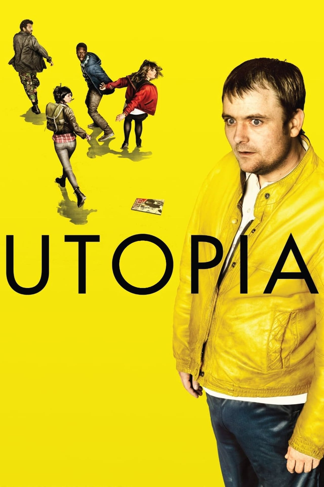

:PROPERTIES:
:ID:       88e25182-ee54-4d2e-b373-b4e06fc292c8
:END:
#+title: Utopia (2013)
#+description: The Utopia (2013) UK TV Show is probably the serie you don't know how much you want to see.
#+description: And let me tell you how much you should probably take a look during COVID19.
#+keywords: blog static
#+author: Yann Esposito
#+email: yann@esposito.host
#+date: [2021-06-01 Tue]
#+lang: en
#+options: auto-id:t
#+startup: showeverything

#+ATTR_HTML: Utopia
#+CAPTION: Utopia

Utopia UK TV show is just a great serie that almost nobody seems to know
about.
There are so much great things about it I have a difficult time to know
where to start.

The *filmography* is both excellent and original. I have never see another
film/TV show with a similar ambiance.
The usage of colors is magistral.
Flashy yellow, green, red.
People wearing yellow clothes.

The *soundtrack* is also pretty excellent and help the overall feel.

The *acting* is just perfect, also the actors are UK great actors.
The actors are not bimbos (like in most US series) where every actor
needs to look good enough.

The *scenario*, in regard to the events related to COVID19 is just perfect.
This is focused on the complotist theory.
But this one turn out to be quite interresting and very close to the
current events.

*Surrealism*.
The balance between an incredible brutal violence and nonchalance really
add to the horror.
It seems to reflect our modern world where people generate extreme violence
but from a distance due to logical conclusions.

As a conclusion, if you are looking for a very innovative TV show then
search no further this one is great.
If you are still unsure, try to search and watch only the opening scene.
This is already so great.
If you cannot stand the first scene, this is probably not for you.
