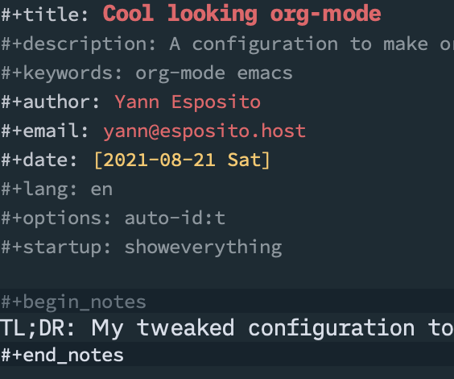
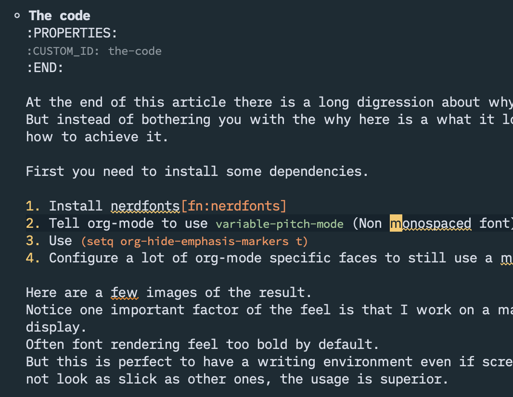
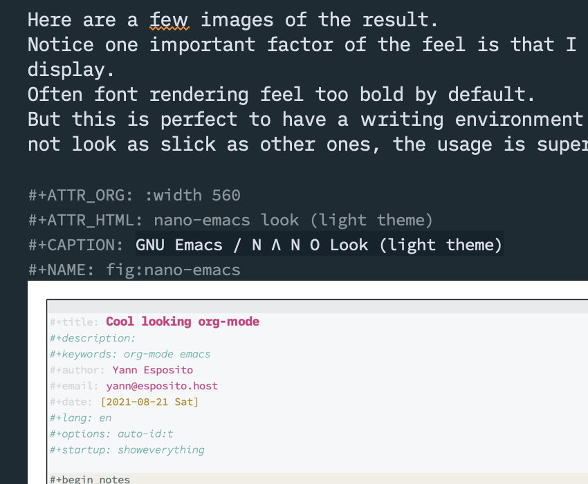
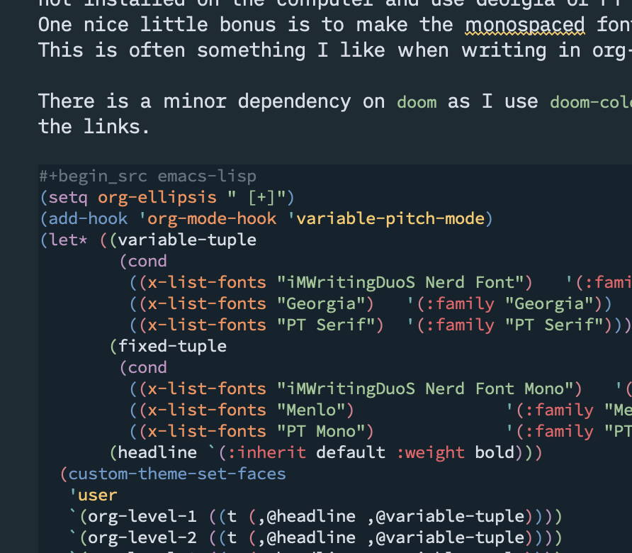

#+title: Cool looking org-mode
#+description: A configuration to make org-mode look even better.
#+keywords: org-mode emacs
#+author: Yann Esposito
#+email: yann@esposito.host
#+date: [2021-08-21 Sat]
#+lang: en
#+options: auto-id:t
#+startup: showeverything

#+begin_notes
TL;DR: My tweaked configuration to make org-mode even more pleasant to use.
#+end_notes

** The code
:PROPERTIES:
:CUSTOM_ID: the-code
:END:

At the end of this article there is a long digression about why I ended up here.
But instead of bothering you with the why here is a what it looks like, and
how to achieve it.

First you need to install some dependencies.

1. Install nerdfonts[fn:nerdfonts]
2. Tell org-mode to use =variable-pitch-mode= (Non monospaced font)
3. Use ~(setq org-hide-emphasis-markers t)~
4. Configure a lot of org-mode specific faces to still use a monospaced font.

Here are a few images of the result.
Notice one important factor of the feel is that I work on a mac with retina
display.
Often font rendering feel too bold by default.
But this is perfect to have a writing environment even if screenshot does
not look as slick as other ones, the usage is superior.

#+ATTR_ORG: :width 560
#+ATTR_HTML: top
#+CAPTION: org-mode headers
#+NAME: fig:top

#+ATTR_ORG: :width 560
#+ATTR_HTML: text
#+CAPTION: org-mode some text
#+NAME: fig:text

#+ATTR_ORG: :width 560
#+ATTR_HTML: img-with-caption
#+CAPTION: org-mode some inline image
#+NAME: fig:img-with-caption

#+ATTR_ORG: :width 560
#+ATTR_HTML: code
#+CAPTION: org-mode with some code block
#+NAME: fig:img-with-caption

#+ATTR_ORG: :width 560
#+ATTR_HTML: Org mode with a light theme
#+CAPTION: Org mode with a light theme
#+NAME: fig:nano-emacs
[[./y-org-mode.png]]

The main trick is to change org-mode to use different font depending on the
kind of bloc.
I use two fonts variant which are an iA Writer clone fonts; iM Writing Nerd Font.

So first you need to install nerd-fonts[fn:nerdfonts].
You will get that =iMWritingDuoS Nerd Font=.
If you look at the code block; I support the case when the font is
not installed and fall back to Georgia or PT Serif.
One nice little bonus of the config is to make the fixed width fonts smaller.
This is often something I like when writing in org-mode.

There is a minor dependency on =doom= as I use =doom-color= for the color of
the links.
But you could easily use any color you like if you do not use doom.

#+begin_src emacs-lisp
(setq org-ellipsis " [+]")
(add-hook 'org-mode-hook 'variable-pitch-mode)
(let* ((variable-tuple
        (cond
         ((x-list-fonts "iMWritingDuoS Nerd Font")   '(:family "iMWritingDuoS Nerd Font"))
         ((x-list-fonts "Georgia")   '(:family "Georgia"))
         ((x-list-fonts "PT Serif")  '(:family "PT Serif"))))
       (fixed-tuple
        (cond
         ((x-list-fonts "iMWritingDuoS Nerd Font Mono")   '(:family "iMWritingDuoS Nerd Font Mono"   :height 160))
         ((x-list-fonts "Menlo")               '(:family "Menlo"    :height 120))
         ((x-list-fonts "PT Mono")             '(:family "PT Mono"  :height 120))))
       (headline `(:inherit default :weight bold)))
  (custom-theme-set-faces
   'user
   `(org-level-1 ((t (,@headline ,@variable-tuple))))
   `(org-level-2 ((t (,@headline ,@variable-tuple))))
   `(org-level-3 ((t (,@headline ,@variable-tuple))))
   `(org-level-4 ((t (,@headline ,@variable-tuple))))
   `(org-level-5 ((t (,@headline ,@variable-tuple))))
   `(org-level-6 ((t (,@headline ,@variable-tuple))))
   `(org-level-7 ((t (,@headline ,@variable-tuple))))
   `(org-level-8 ((t (,@headline ,@variable-tuple))))
   `(org-document-title ((t (,@headline ,@variable-tuple))))
   `(variable-pitch ((t ,@variable-tuple)))
   `(fixed-pitch ((t ,@fixed-tuple)))
   '(org-ellipsis ((t (:inherit fixed-pitch :foreground "gray40" :underline nil))))
   '(org-block ((t (:inherit fixed-pitch))))
   '(org-block-begin-line ((t (:inherit fixed-pitch))))
   '(org-block-end-line ((t (:inherit fixed-pitch))))
   '(org-src ((t (:inherit fixed-pitch))))
   '(org-properties ((t (:inherit fixed-pitch))))
   '(org-code ((t (:inherit (shadow fixed-pitch)))))
   '(org-date ((t (:inherit (shadow fixed-pitch)))))
   '(org-document-info ((t (:inherit (shadow fixed-pitch)))))
   '(org-document-info-keyword ((t (:inherit (shadow fixed-pitch)))))
   '(org-drawer ((t (:inherit (shadow fixed-pitch)))))
   '(org-indent ((t (:inherit (org-hide fixed-pitch)))))
   `(org-link ((t (:inherit fixed-pitch :foreground ,(doom-color 'blue) :underline t))))
   '(org-meta-line ((t (:inherit (font-lock-comment-face fixed-pitch)))))
   '(org-property-value ((t (:inherit fixed-pitch))) t)
   '(org-special-keyword ((t (:inherit (font-lock-comment-face fixed-pitch)))))
   '(org-table ((t (:inherit fixed-pitch))))
   '(org-tag ((t (:inherit (shadow fixed-pitch) :weight bold :height 0.8))))
   '(org-verbatim ((t (:inherit (shadow fixed-pitch)))))))
#+end_src

[fn:nerdfonts] https://www.nerdfonts.com

** Digression about why I did that;
:PROPERTIES:
:CUSTOM_ID: digression-about-why-i-did-that-
:END:

For some reason a went to the rabbit hole of tweaking my emacs.
In fact, it first started as; let's try to switch from
=doom-emacs=[fn:doom-emacs] to =nano-emacs=[fn:nano-emacs].
But, doing so, I realized I wouldn't be able to reach the quality and
optimization provided by doom-emacs myself.
So instead of doing this, I first tried to copy the theme of nano.
Then I realized one of the biggest factor of nano look & feel was
its usage of "Roboto Mono" but with weight light (or Thin).

See

#+ATTR_ORG: :width 560
#+ATTR_HTML: nano-emacs look (light theme)
#+CAPTION: GNU Emacs / N Λ N O Look (light theme)
#+NAME: fig:nano-emacs
[[./nano-emacs-light.png]]

#+ATTR_ORG: :width 560
#+ATTR_HTML: nano-emacs look (dark theme)
#+CAPTION: GNU Emacs / N Λ N O Look (dark theme)
#+NAME: fig:nano-emacs
[[./nano-emacs-dark.png]]

OK so...
I just tried to match the theme colors.
It was easy to create a theme with matching colors.
*But*, to make it really looks like nano; almost monochrome with a few accent
colors; it would mean a lot more work than anyone could expect.
Every emacs mode need to be tweaked.
Most doom themes expect either a classical, many colors, or a totally
monochromatic, but not this generic idea of ; everything is monochromatic
with very few exceptions.
This choice is also what makes nano looks so good too.
This is not just about the color, but about a lot more details than that.
Using the good colors only at the right place is difficult to achieve.
And not only the colors, but also, the correct fonts, the spacing of text
elements etc...

Unfortunately if you want the nano look and feel in doom, it is much more
work than just copying the nano theme.

But this research of look and feel opened the door to using thin fonts in
emacs.
And also tweaking the fonts which really improve the look & feel of emacs.

With this conf, I do not use the same font for coding and for writing
prose or a blog post with code blocks.
So far, I like this new look and feel.

[fn:doom-emacs] https://github.com/hlissner/doom-emacs
[fn:nano-emacs] https://github.com/rougier/nano-emacs
