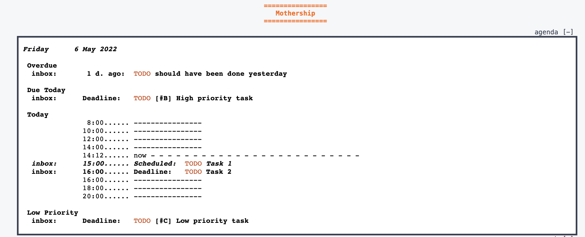

#+title: Org agenda on your startup page
#+description:
#+keywords: blog static
#+author: Yann Esposito
#+email: yann@esposito.host
#+date: [2022-05-05 Thu]
#+lang: en
#+options: auto-id:t
#+startup: showeverything

* Your org-agenda at your homepage                                   :ATTACH:
:PROPERTIES:
:CUSTOM_ID: your-org-agenda-at-your-homepage
:ID:       d88a1458-07bb-4c73-86c3-9f09b3d6a1ad
:END:

During most of the day my emacs is open.
But I sometime forget to look at my org-agenda.
This is why I wanted to find another way to be exposed to it.

And one thing I am mostly exposed to is my personal start page.
This is just the default page I see when I open my browser.

Here is the end result:

#+ATTR_ORG: :width 560
#+ATTR_HTML: Generate HTML from the Agenda
#+CAPTION: The result inside my start page
#+NAME: fig:agenda-html

My start page is named /mothership/.
And I just put the org-agenda at the top of the page inside an iframe.
I have a service that start a server on localhost and I configured my
browser to use it as startup page.
That's it.

So now, here is how to sync my org-agenda on this start page.

In my ~config.el~:

#+begin_src elisp
(setq y/mothership "~/dev/mothership/")
(setq org-agenda-custom-commands
      `(("g" "Plan Today"
         ((agenda "" ((org-agenda-span 'day))))
         nil
         ( ,(concat y/mothership "/agenda.html") ))))
#+end_src

This provide a custom org agenda command and link that custom command to
the export file =~/dev/mothership/agenda.html=.

And a shell script:

#+begin_src bash
#!/usr/bin/env bash
emacs --batch \
  --load "$HOME/.emacs.d/init.el" \
  --eval '(org-batch-store-agenda-views)' \
  --kill
#+end_src

#+begin_src bash
*/5 * * * * /Users/esposito/dev/mothership/export-agenda.sh
#+end_src

And finally in my start-page html I just need to add an iframe like so:

#+begin_src html
<iframe id="agenda" src="agenda.html"></iframe>
#+end_src

But as I also want to be able to toggle the agenda, and auto-resize the
iframe.
So I added a bit of js code:

#+begin_src html

[-]
 

<iframe id="agenda" src="agenda.html" onload="resizeIframe(this)"></iframe>

#+end_src

And that's it.
That's a neat trick, and so I'm glad to put a small post about it.
** Bonuses
:PROPERTIES:
:CUSTOM_ID: bonuses
:END:
*** auto-resize iframe
:PROPERTIES:
:CUSTOM_ID: auto-resize-iframe
:END:

In order to auto-resize the iframe you must have a non =file:///= URL in the browser.
So you must serve your start page.
After a lot of different way to serve my pages, I finally use ~lighttpd~
inside a ~nix-shell~.

So I added the following to my startpage code:

A [[./lighttpd.conf]] file

#+begin_src conf :tangle lighttpd.conf
server.bind = "127.0.0.1"
server.port = 31337
server.document-root = var.CWD

index-file.names = ( "index.html" )

mimetype.assign = (
  ".css"        =>  "text/css",
  ".gif"        =>  "image/gif",
  ".htm"        =>  "text/html",
  ".html"       =>  "text/html",
  ".jpeg"       =>  "image/jpeg",
  ".jpg"        =>  "image/jpeg",
  ".js"         =>  "text/javascript",
  ".png"        =>  "image/png",
  ".swf"        =>  "application/x-shockwave-flash",
  ".txt"        =>  "text/plain",
  ".gmi"        =>  "text/plain",
  ".svg"        =>  "image/svg+xml",
  ".svgz"       =>  "image/svg+xml"
)

# Making sure file uploads above 64k always work when using IE or Safari
# For more information, see http://trac.lighttpd.net/trac/ticket/360
$HTTP["useragent"] =~ "^(.*MSIE.*)|(.*AppleWebKit.*)$" {
  server.max-keep-alive-requests = 0
}
#+end_src

With a

#+begin_src bash :tangle serve.sh
#! /user/bin/env nix-shell
#! nix-shell shell.nix -i bash
webdir="_site"
port="$(grep server.port ./lighttpd.conf|sed 's/[^0-9]*//')"
echo "Serving: $webdir on http://localhost:$port" && \
lighttpd -f ./lighttpd.conf -D
#+end_src

I have a frozen nixpkgs dependencies via =niv=.
But you could probably simply replace the line by:

#+begin_src
#! nix-shell -p lighttpd -i bash
#+end_src

And it should work fine.

*** Start your server at startup on macOS
:PROPERTIES:
:CUSTOM_ID: start-your-server-at-startup-on-macos
:END:

Last but not least, starting this start page server when I login.

So for that you should demonize with launchd.

I created a [[./y.mothership.plist]] file to put in =~/Library/LauchAgents/=:

#+begin_src xml :tangle y.mothership.plist
<?xml version="1.0" encoding="UTF-8"?>
<!DOCTYPE plist PUBLIC "-//Apple//DTD PLIST 1.0//EN" "http://www.apple.com/DTDs/PropertyList-1.0.dtd">
<plist version="1.0">
<dict>
    <key>Label</key>
    <string>mothership</string>
    <key>ProgramArguments</key>
    <array>
        <string>/bin/zsh</string>
        <string>-c</string>
        <string>$HOME/y/mothership/serve.sh</string>
    </array>
    <key>StandardOutPath</key>
    <string>/var/log/mothership.log</string>
    <key>StandardErrorPath</key>
    <string>/var/log/mothership.log</string>
</dict>
</plist>
#+end_src

Then to ensure that the executable ~nix-shell~ is present in the PATH for the
demon, I ran:

#+begin_src
launchctl config user path "$PATH"
#+end_src

This will affect the path of all users, but as I am the only user on my
computer this is fine for me.

Then:

#+begin_src
launchctl load ~/Library/LaunchAgents/y.mothership.plist
launchctl start mothership
#+end_src

And that's about it.
