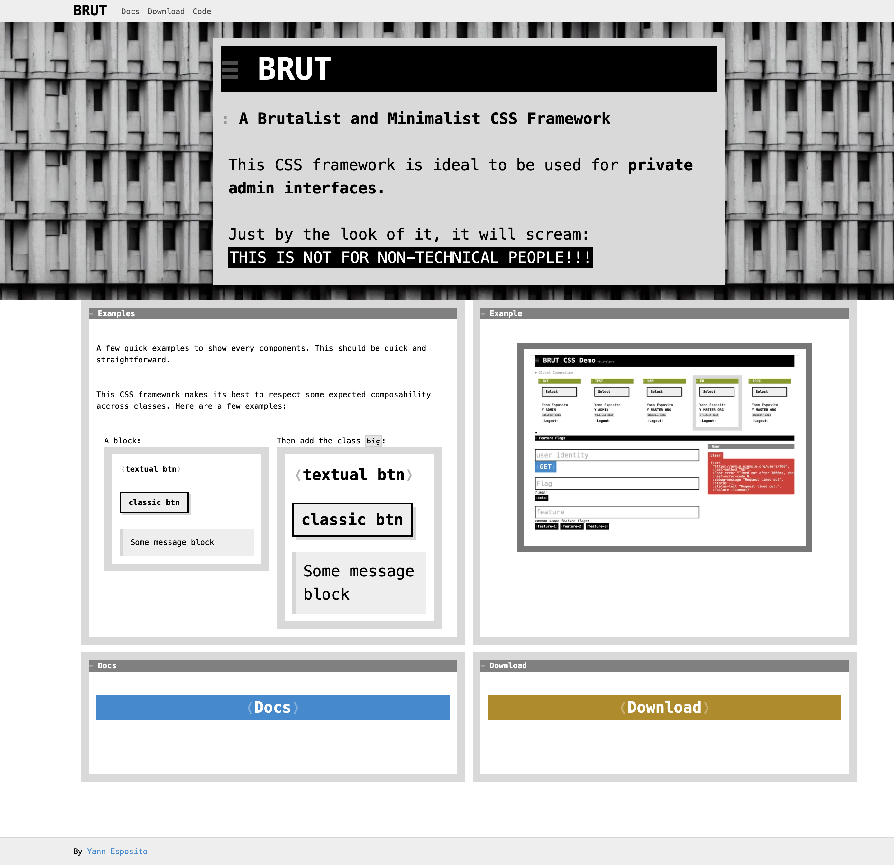
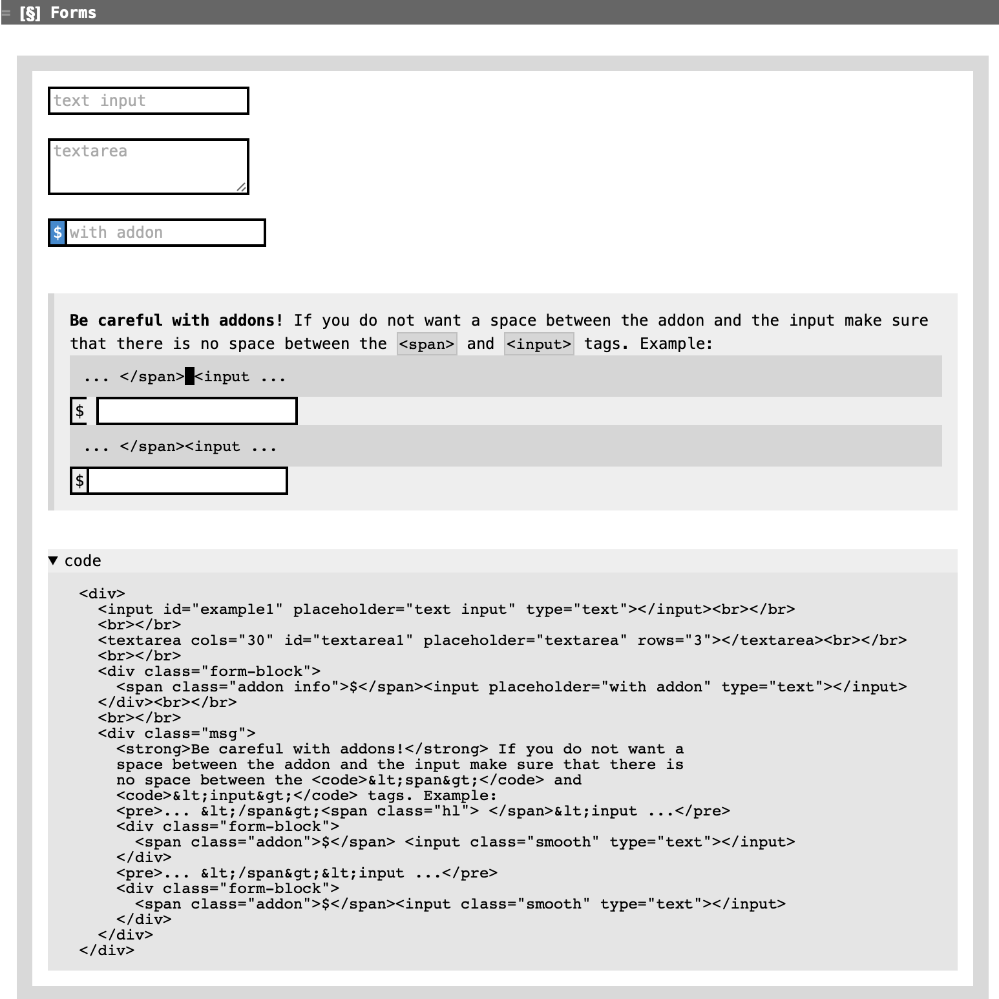

#+title: BRUT: a bare-bones CSS Framework
#+description:
#+keywords: blog static
#+author: Yann Esposito
#+email: yann@esposito.host
#+date: [2024-07-25 Thu]
#+lang: en
#+options: auto-id:t
#+startup: showeverything

#+begin_notes
/TL;DR:/ [[https://brut.esy.fun][=brut.esy.fun=]]

*Warning*: I am not a UI developer, my choices to build this CSS Framework are certainly
not using any current best practices, but you know:  "It works for me™", so.
Also that being said, I used this for a few different internal projects and I was happy
enough about the result to blog about it.
#+end_notes

#+ATTR_ORG: :width 560
#+ATTR_HTML: Brut CSS Framework Homepage
#+CAPTION: Brut CSS Framework Hompage
#+NAME: fig:brut-homepage

I built many private web-apps. Generally they are internal tools I built either
for myself of for an internal team of developers.
Along the years I started to embrace a /brutalist/ design for these tools.
Behind the seemingly crude exterior of a brutalist website lies a system that
strips away unnecessary elements and presents itself to users as bare-bones
utility.

While it's true that having both form and function is ideal, I believe there's
value in exploring websites that prioritize UX efficiency over aesthetics.
By focusing on the immediate utility of an application rather than getting
bogged down in nuances like color palette or image selection, we can create
tools that are unapologetically functional.

Using a brutalist design approach forces us to confront our priorities and
eliminate distractions.
We're not tempted to waste time agonizing over the perfect shade of blue or
which image best conveys a particular sentiment.
Instead, we focus on crafting a tool that gets the job done with minimal fuss.
One of the most compelling aspects of brutalism is its ability to immediately
convey a sense of purpose.
A website built in this style screams "not for everyone" and focuses attention
squarely on the content rather than trying to impress visitors with flashy
visuals.

Recently, I've been working on my own specialized CSS framework designed
specifically for building nerd-targeted web applications.
This project grew out of my professional experience creating internal
administration tools that needed to be shared with other developers and
managers.

Here are my goals for this framework:
- I want a dense, information-rich environment that defies modern design best
  practices and eschews empty space.
- I'm aiming for a minimalist approach with a limited number of components. This
  will help me avoid adding unnecessary features over time.
- The application should immediately convey its professional nature and
  intimidate non-core users from trying to use it.

* Digressions on the brut website
:PROPERTIES:
:CUSTOM_ID: digressions-on-the-brut-website
:END:

If you take a look at the Brut website docs, you see I provide an example with
the code to generate that example.

#+ATTR_ORG: :width 560
#+ATTR_HTML: Brut CSS example and the code to generate it.
#+CAPTION: Brut CSS example and the code to generate it.
#+NAME: fig:code-example

At first, I wrote the code in HTML, copy/pasting the code in a ~<pre>~ block and
changing all ~<~ by ~&lt;~ etc…
But quickly, as I wanted to have more and more examples, this quickly became tedious.
I opted to generate the HTML from a program.

And if you need to choose a language that is powerful enough and must generate
HTML, I think Clojure is one of the best.
In particular due to [[https://github.com/weavejester/hiccup][hiccup]] which is the best DSL I ever used other the years to
generate HTML.

As a bonus, I wanted to be able to launch the building of the website easily, so
I used [[https://babashka.org/][babashka]] so far this was a really great experience.
Babashka can easily be used as a task launcher, a bit like make.

With this I used babashka to automate CSS generation/minimization as well as
website generation.

So, let's get back to generating html that contains both an example and its code
that could be shown to the end user.

So I could write this small clojure function that takes a HTML description (not
a HTML string, but a structure that you use to generate HTML) and return a
pretty print view of the generated HTML and put that in a ~<pre>~:

#+begin_src clojure
(defn to-pre [hc]
  (h/html {:escape-strings? true}
          [:pre (-> (str (h/html hc))
                    html-pp)]))
#+end_src

For example:

#+begin_src
> (to-pre [:div.row [:span "hello"]]) ⇒
#+end_src

will generate the following string that will print as:

#+begin_src html
<pre>
  &lt;div class=&quot;row&quot;&gt;
    &lt;span&gt;hello&lt;/span&gt;
  &lt;/div&gt;
</pre>
#+end_src

And render in the browser as:

#+begin_src html

  hello

#+end_src

All with the expected indentation.
So that's very nice.
If you wonder how I could pretty print HTML; I am cheating and calling both [[http://www.html-tidy.org/][=tidy=]]
and [[https://www.w3.org/Tools/HTML-XML-utils/man1/hxselect.html][=hxselect=]] command line tools:

#+begin_src clojure
(defn html-pp [html-str]
  (let [xhtml (:out @(process ["tidy" "-i" "-asxhtml" "-quiet" "-utf8"]
                              {:in html-str
                               :out :string}))]
    (:out @(process ["hxselect" "-c" "body"]
                    {:in xhtml
                     :out :string}))))
#+end_src

And this really helped and I could easily generate big blocks using that strategy:

#+ATTR_ORG: :width 560
#+ATTR_HTML: Show all possible 3 columns size combination
#+CAPTION: Show all possible 3 columns size combination
#+NAME: fig:brut-homepage

which was generated with this short hiccup snippet:

#+begin_src clojure
[:div
 [:h3 "3 columns"]
 [:div
  (for [i (range 11 0 -1)
        j (range (- 11 i) -1 -1)]
    (let [k (- 12 i j)
          cli (str "c" i)
          clj (str "c" j)
          clk (str "c" k)]
      (if (= j 0)
        [:br]
        [:div.row
         (when (> j 0)
           [:div.b {:class clj} clj])
         (when (> i 0)
           [:div.bg-neutral {:class cli} cli])
         (when (> k 0)
           [:div.r {:class clk} clk])])))]]
#+end_src

Overall, I do not regret using babashka for this small project. It has been delightful.
