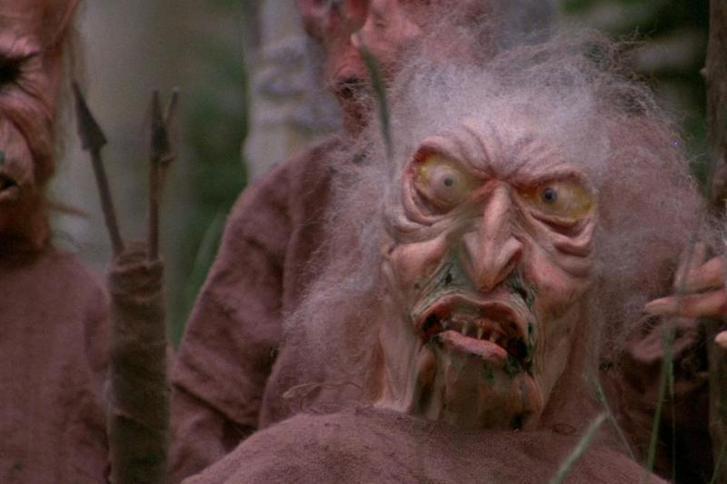
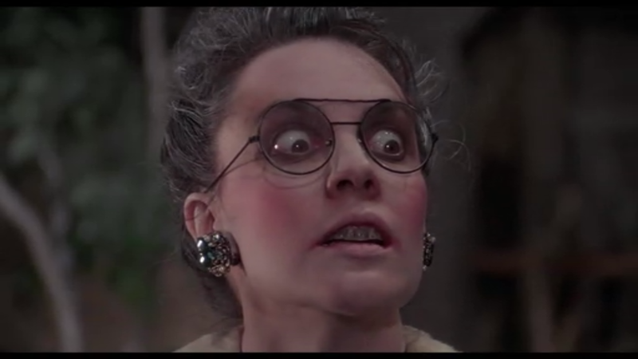
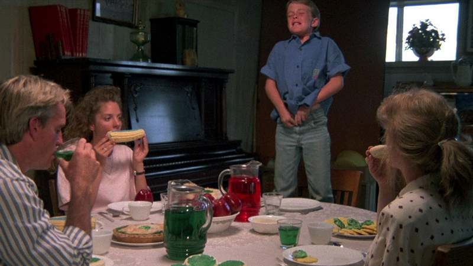

#+Title: Troll 2
#+Subtitle: How a terrible movie can be entertaining
#+Author: Yann Esposito
#+Email: yann@esposito.host
#+Date: [2019-08-17 Sat]
#+KEYWORDS: movie
#+DESCRIPTION:
#+LANGUAGE: en
#+LANG: en
#+OPTIONS: H:5 auto-id:t
#+STARTUP: showeverything

#+begin_notes
I watched what might be the most failed movie of all time and I still
enjoyed greatly the show.
#+end_notes

I recently wanted to watch again an horror teen movie I watched when I was
a young boy: Troll.
But I discovered there were a movie called Troll 2.
I guessed that it must be the following one.

Oh god, I saw the imdb note was, really, really bad.
But who cares, I watched it.

And here is a resume of my experience:

* The watching
:PROPERTIES:
:CUSTOM_ID: the-watching
:END:

Troll 2 synopsis is a family that goes camping to Nilbog.
The son of the family see his dead grandfather that warn him against
Goblins that make you eat things that transform you and then they eat you.
Of course nobody listen to the warn of the boy, the family goes to Nilbog
which is of course infested by Goblins.

Troll 2 is bad on most criterion you use to measure the quality of a movie.

During the first minutes of the movie, you get to see the costume of the
goblins.
Those costume looks very bad and cheap.
So much you can only find them not terrorizing but funny and ridiculous.

#+CAPTION: One goblin during the introduction scene of Troll 2
#+NAME: fig:troll-2-intro
#+ATTR_HTML: A goblin

Soon after that, you realize the acting of all actors is extremely bad.
In fact, it is so bad, you might not believe me how bad it is.
To give you an idea, the only equal bad acting I ever witnessed was while
looking at amateurs first Youtube movie trying to follow a scenario.
Apparently all actor were amateurs, it was their first and last movie.

#+CAPTION: One particularly terrible acting scene
#+NAME: fig:bad-acting
#+ATTR_HTML: A bad acting demonstration

The dialog are, really something...
For example the expression "clusters of hemorrhoid" is used in a non ironic
dialog.

The scenario is terrible.
For example, most of the thing occurring suffer from terrible plot holes or
terrible mistakes that make everything hard to believe even if you accept
the premises of a world were Goblin would exists.
For example, the grandfather ghost can stop time for 30 seconds for no
reason at all.

The realization is a series of basic mistakes.
Actors are not in the same places after all plan cut for example.
Some filmed scene feel so wrong.

I forgot to give a word about the music.
It is like the director choose the worst music to go along each scene.

The first ending is really, quite surprising.
They beat the monsters with, what I believe was a failed attempt at humor.
It misses the point so bad, that the irony still make it funny.

#+CAPTION: Our hero save the day by urinating on the table. His family is frozen for 30s said grandpa, they were for 70s.
#+NAME: fig:prevent-eating
#+ATTR_HTML: Eliott prevents his family to eat the food by urinating on the table

Of course, the very last scene is a classical so terrible cliché.
To let you close the experience in awe.

But there is a bonus, the cherry on the cake.
During all the movie, it is *never* question of a Troll at all.
The monsters are all Goblin, not Troll.
I think the word "troll" is not pronounced once in the movie.

Still, it was quite entertaining.

#  LocalWords:  Nilbog cliché

* After the movie
:PROPERTIES:
:CUSTOM_ID: after-the-movie
:END:

What is really interesting though is that I really enjoyed the watch.
It was so bad, that in the end, you do not really enter in the movie, but
really just analyze the movie, and you start to see how much the movie is bad.
And this is so fun.
For example, there are some attempts at humor, but almost all of them fail terribly.
And so, you can laugh at how much it failed.

Once going to imdb, I discovered I wasn't alone in loving that terrible
movie.
Now, I don't know if I should give that movie a 1 or 2 stars or 8 to 9
stars because it was so entertaining.

But I learned a few nice anecdotes about that movie.

It was realized in America by Claudio Fragasso who didn't speak fluent
English.
He and his wife were apparently irritated by many of her friends turning
vegetarian.
He brought the film crew over with him from Italy.
None of them spoke English either.

#+begin_quote
“The cast had few experienced actors, and was primarily assembled from
residents of nearby towns who responded to an open casting call. George
Hardy was a dentist with no acting experience who showed up for fun, hoping
to be cast as an extra, only to be given one of the film’s largest speaking
roles. Don Packard, who played the store owner, was actually a resident at
a nearby mental hospital, and was cast for—and filmed—his role while on a
day trip; after recovering and being released from the hospital, he
recalled that he had no idea what was happening around him, and that his
disturbed “performance” in the film was not acting”
#+end_quote

